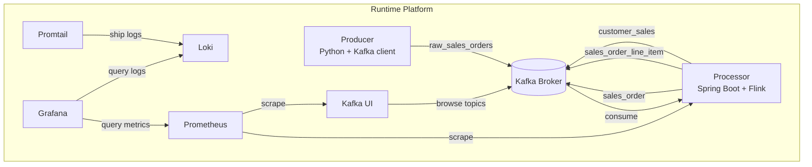
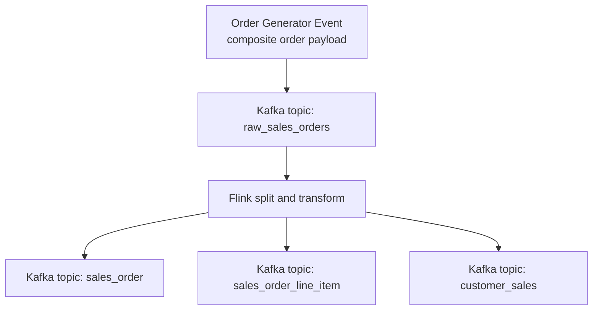

# Kafka Flink with Helm and Argo CD

This repository implements a realtime sales processing platform that can run in two local modes:

- Docker Compose for fast application development and topic validation.
- kind plus Helm plus Argo CD for a GitOps-like local Kubernetes workflow.

The pipeline shape is:

- The Python producer emits composite order events to `raw_sales_orders`.
- The Java Spring Boot app starts a Flink DataStream job.
- Flink splits and transforms records into `sales_order`, `sales_order_line_item`, and `customer_sales`.
- Optional observability services in Kubernetes provide Prometheus, Loki, and Grafana.

## High-Level Architecture

### Component Diagram



### Dataflow Diagram



## Operations Runbook

Use the runbook for complete local procedures, including startup, validation, UI access, troubleshooting, and reset:

- [runbook.md](runbook.md)

## Repository Layout

- `producer`: Python Kafka producer for composite sales orders.
- `processor`: Spring Boot application that launches the Flink topology.
- `charts/realtime-app`: Helm chart for producer, processor, and optional Kafka.
- `environments`: Helm values for `dev`, `qa`, and `prd`.
- `argocd`: Argo CD Application manifests.
- `scripts`: Local bootstrap and image build helpers.
- `runbook.md`: Day-2 operations procedures for Compose and Argo CD workflows.

## Quick Start: Docker Compose

Start Kafka, create the required topics, and run both applications:

```bash
docker compose up --build
```

Once the stack is running:

- Kafka is exposed on `localhost:9094`
- Kafka UI is exposed on `http://localhost:8080`
- The producer writes composite order events into `raw_sales_orders`
- The processor fans out records into `sales_order`, `sales_order_line_item`, and `customer_sales`

Inspect the Kafka topics from the running local stack:

```bash
./scripts/list-topics.sh
./scripts/consume-topic.sh raw_sales_orders 3
./scripts/check-pipeline-topics.sh
```

## Quick Start: kind + Helm + Argo CD

Use this flow to run the dev environment on kind while building images locally with Docker.

1. Create a kind cluster and install Argo CD:

   ```bash
   ./scripts/bootstrap-kind.sh
   ```

2. Build producer/processor images locally and load them into kind:

   ```bash
   ./scripts/build-images.sh
   ```

3. Apply the Argo CD dev application:

   ```bash
   kubectl apply -f argocd/dev.yaml
   ```

4. Wait for Argo CD and the app to sync:

   ```bash
   kubectl -n argocd get pods
   kubectl -n argocd get applications
   kubectl -n realtime-dev get pods
   ```

5. Verify the Kafka pipeline in the dev namespace:

   ```bash
   kubectl -n realtime-dev get pods
   kubectl -n realtime-dev logs deploy/realtime-dev-processor --tail=100
   ```

Dev environment behavior:

- Uses in-cluster Kafka from the Helm dependency (`kafka.enabled=true` in `environments/dev/values.yaml`).
- Uses locally built images already loaded into kind (`imagePullPolicy: Never`).
- Argo CD tracks this repository and syncs the Helm chart path `charts/realtime-app` with `environments/dev/values.yaml`.

## Environment Strategy

- `dev`: Local kind deployment with in-cluster Kafka from the Helm dependency.
- `qa`: GitOps deployment against a shared Kafka bootstrap service and registry-hosted images.
- `prd`: Same logical topology as `qa` with higher replica counts and faster Flink checkpoints.

## Configuration

### Producer

- `KAFKA_BOOTSTRAP_SERVERS`: Kafka bootstrap servers.
- `RAW_TOPIC`: Source topic name. Default is `raw_sales_orders`.
- `PRODUCER_INTERVAL_MS`: Publish interval in milliseconds.

### Processor

- `KAFKA_BOOTSTRAP_SERVERS`: Kafka bootstrap servers.
- `APP_RAW_SALES_ORDERS_TOPIC`: Source topic.
- `APP_SALES_ORDER_TOPIC`: Sink topic for order headers.
- `APP_SALES_ORDER_LINE_ITEM_TOPIC`: Sink topic for order line items.
- `APP_CUSTOMER_SALES_TOPIC`: Sink topic for per-customer aggregates.
- `APP_CONSUMER_GROUP_ID`: Kafka consumer group.
- `APP_CHECKPOINT_INTERVAL_MS`: Flink checkpoint interval.

## Build Commands

Build the Java processor jar:

```bash
cd processor
mvn -DskipTests package
```

Run the producer directly:

```bash
cd producer
uv sync
uv run producer
```

## Notes

- `qa` and `prd` values assume Kafka already exists and is reachable at the configured bootstrap service address.
- The Flink job is embedded in the Spring Boot process for a simple local and GitOps deployment model.
