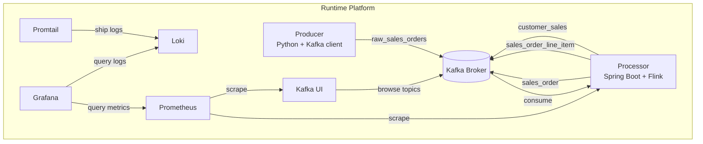
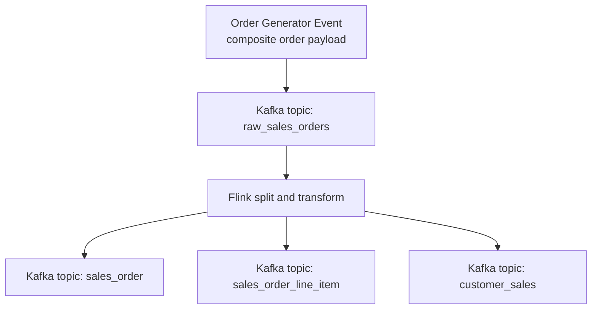

# Kafka Flink with Helm and Argo CD

This repository implements a realtime sales processing platform that can run in two local modes:

- Docker Compose for fast application development and topic validation.
- kind plus Helm plus Argo CD for a GitOps-like local Kubernetes workflow.

The pipeline shape is:

- The Python producer emits composite order events to `raw_sales_orders`.
- The Java Spring Boot app starts a Flink DataStream job.
- Flink splits and transforms records into `sales_order`, `sales_order_line_item`, and `customer_sales`.
- Kafka Connect sinks processed topics into Iceberg tables on MinIO and mirrors topic data into Postgres landing tables.
- dbt builds `stage` and `gold` models in Postgres as a Snowflake-like analytics layer.
- Optional observability services in Kubernetes provide Prometheus, Loki, and Grafana.

## High-Level Architecture

### Component Diagram



### Dataflow Diagram



## Operations Runbook

Use the runbook for complete local procedures, including startup, validation, UI access, troubleshooting, and reset:

- [runbook.md](runbook.md)

## Repository Layout

- `producer`: Python Kafka producer for composite sales orders.
- `processor`: Spring Boot application that launches the Flink topology.
- `charts/realtime-app`: Helm chart for producer, processor, Kafka UI, MinIO, Postgres, Kafka Connect, dbt bootstrap, Airflow, and optional Kafka.
- `environments`: Helm values for `dev`, `qa`, and `prd`.
- `argocd`: Argo CD Application manifests.
- `connect`: Kafka Connect image and connector configurations (Iceberg + JDBC sinks).
- `analytics/dbt`: dbt project for stage and gold models in Postgres.
- `analytics/sql`: Database bootstrap SQL (landing, stage, gold schemas).
- `airflow`: Apache Airflow image and DAGs for scheduled dbt orchestration.
- `scripts`: Local bootstrap and image build helpers.
- `runbook.md`: Day-2 operations procedures for Compose and Argo CD workflows.

## Quick Start: Docker Compose

Use one of these local startup paths depending on what you need.

Start the full stack, including Kafka, producer, processor, Kafka Connect, Postgres, MinIO, and the one-shot dbt run:

```bash
docker compose up -d --build
```

Start only the core streaming path for a faster inner loop:

```bash
docker compose up -d --build kafka topic-init kafka-ui producer processor
```

Once the stack is running:

- Kafka is exposed on `localhost:9094`
- Kafka UI is exposed on `http://localhost:8080`
- The producer writes composite order events into `raw_sales_orders`
- The processor fans out records into `sales_order`, `sales_order_line_item`, and `customer_sales`

Inspect the Kafka topics from the running local stack:

```bash
./scripts/list-topics.sh
./scripts/consume-topic.sh raw_sales_orders 3
./scripts/check-pipeline-topics.sh
```

Start the downstream lakehouse + warehouse layer:

```bash
make lakehouse-up
```

Start Airflow only:

```bash
make airflow-up
```

Run dbt transforms (`landing` -> `stage` -> `gold`) in Postgres:

```bash
make dbt-run
```

Local endpoints for this layer:

- MinIO API: `http://localhost:9000`
- MinIO Console: `http://localhost:9001`
- Kafka Connect REST: `http://localhost:8083`
- Airflow UI: `http://localhost:8084`
- Postgres: `localhost:5432` (user/password/db: `analytics`)

Local Airflow credentials:

- Username: `admin`
- Password: `admin`

Expected container behavior:

- `topic-init`, `minio-init`, and `connect-init` are one-shot init containers and normally end in `Exited (0)`.
- `dbt` is also a one-shot service and normally ends in `Exited (0)` after `dbt run` completes.
- A finished `dbt` container does not mean stage or gold data is missing.

## Quick Start: kind + Helm + Argo CD

Use this flow to run the dev environment on kind while building images locally with Docker.

1. Create a kind cluster and install Argo CD:

   ```bash
   ./scripts/bootstrap-kind.sh
   ```

2. Build producer, processor, connect, dbt, and airflow images locally and load them into kind:

   ```bash
   ./scripts/build-images.sh
   ```

3. Apply the Argo CD dev application:

   ```bash
   kubectl apply -f argocd/dev.yaml
   ```

4. Wait for Argo CD and the app to sync:

   ```bash
   kubectl -n argocd get pods
   kubectl -n argocd get applications
   kubectl -n realtime-dev get pods
   ```

   If Argo CD shows `SYNC STATUS: Unknown` with a `ComparisonError` about repository access,
   register Git credentials in Argo CD for the configured source repo in `argocd/dev.yaml`.
   You can still validate local chart changes immediately with direct Helm commands:

   ```bash
   make helm-reboot-dev
   make helm-health-dev
   ```

5. Verify the Kafka pipeline in the dev namespace:

   ```bash
   kubectl -n realtime-dev get pods
   kubectl -n realtime-dev logs deploy/realtime-dev-realtime-app-processor --tail=100
   ```

6. Verify the warehouse and scheduling layer in the dev namespace:

   ```bash
   kubectl -n realtime-dev get pods
   kubectl -n realtime-dev logs job/realtime-dev-realtime-app-dbt --tail=100
   kubectl -n realtime-dev logs deploy/realtime-dev-realtime-app-airflow --tail=100
   kubectl -n realtime-dev port-forward svc/realtime-dev-realtime-app-airflow 8084:8080
   kubectl -n realtime-dev port-forward svc/realtime-dev-realtime-app-minio 9001:9001
   ```

7. Access local UIs and Postgres when running in kind:

   ```bash
   kubectl -n argocd port-forward svc/argocd-server 8443:443
   kubectl -n realtime-dev port-forward svc/realtime-dev-realtime-app-kafka-ui 8082:8080
   kubectl -n realtime-dev port-forward svc/realtime-dev-realtime-app-minio 9001:9001
   kubectl -n realtime-dev port-forward svc/realtime-dev-realtime-app-postgres 5433:5432
   ```

   - Argo CD URL: `https://localhost:8443`
   - Argo CD username: `admin`
   - Argo CD password command:

   ```bash
   kubectl -n argocd get secret argocd-initial-admin-secret -o jsonpath='{.data.password}' | base64 --decode; echo
   ```

   - Kafka UI URL: `http://localhost:8082`
   - MinIO Console URL: `http://localhost:9001` (user: `minio`, password: `minio123`)
   - Postgres: host `127.0.0.1`, port `5433`, user `analytics`, password `analytics`, db `analytics`

Dev environment behavior:

- Uses in-cluster Kafka from the Helm dependency (`kafka.enabled=true` in `environments/dev/values.yaml`).
- Uses locally built producer, processor, Kafka Connect, dbt, and Airflow images already loaded into kind (`imagePullPolicy: Never`).
- Deploys MinIO, Postgres, Kafka Connect, a one-shot dbt bootstrap Job, and Airflow in the same Helm release.
- Argo CD tracks `https://github.com/paulchen8206/Kafka-Flink-with-Helm-and-Argo-CD.git` on branch `main` and syncs `charts/realtime-app` with `environments/dev/values.yaml`.

## Environment Strategy

- `dev`: Local kind deployment with in-cluster Kafka from the Helm dependency.
- `qa`: GitOps deployment against a shared Kafka bootstrap service and registry-hosted images.
- `prd`: Same logical topology as `qa` with higher replica counts and faster Flink checkpoints.

## Configuration

### Producer

- `KAFKA_BOOTSTRAP_SERVERS`: Kafka bootstrap servers.
- `RAW_TOPIC`: Source topic name. Default is `raw_sales_orders`.
- `PRODUCER_INTERVAL_MS`: Publish interval in milliseconds.

### Processor

- `KAFKA_BOOTSTRAP_SERVERS`: Kafka bootstrap servers.
- `APP_RAW_SALES_ORDERS_TOPIC`: Source topic.
- `APP_SALES_ORDER_TOPIC`: Sink topic for order headers.
- `APP_SALES_ORDER_LINE_ITEM_TOPIC`: Sink topic for order line items.
- `APP_CUSTOMER_SALES_TOPIC`: Sink topic for per-customer aggregates.
- `APP_CONSUMER_GROUP_ID`: Kafka consumer group.
- `APP_CHECKPOINT_INTERVAL_MS`: Flink checkpoint interval.

### Kafka Connect and Lakehouse Layer

- `connect` service runs:
   - Iceberg sink connectors for `sales_order`, `sales_order_line_item`, and `customer_sales` into MinIO (`warehouse/iceberg`).
   - JDBC sink connector for the same topics into Postgres `landing` schema.
- Connector registration happens automatically in `connect-init` in Compose and via a Kubernetes Job in the Helm release.

### dbt and Warehouse Layer

- dbt project location: `analytics/dbt`
- Source schema: `landing`
- dbt target schema: `public`
- Stage schema suffix: `stage`, which resolves to physical schema `public_stage`
- Gold schema suffix: `gold`, which resolves to physical schema `public_gold`
- Stage models are materialized as views
- Gold models are materialized as tables
- Main gold model: `gold_customer_sales_summary`

### Airflow Scheduling Layer

- Airflow DAG location: `airflow/dags/dbt_warehouse_schedule.py`
- DAG ID: `dbt_warehouse_schedule`
- Schedule: every 5 minutes
- The DAG runs `dbt deps` and `dbt run` against the same local Postgres warehouse used by the manual `dbt` service
- In the dev Helm path, Airflow runs inside the same release and serves its UI through the `realtime-dev-realtime-app-airflow` service

## Data Validation

Use these checks after the stack is up to verify each layer of the pipeline.

Verify Kafka topic fan-out:

```bash
./scripts/check-pipeline-topics.sh
```

Verify landing, stage, and gold row counts in Postgres:

```bash
make verify-warehouse
```

List dbt-created relations and materializations:

```bash
make verify-dbt-relations
```

If you need to rerun dbt manually:

```bash
make dbt-run
```

If you want to trigger the scheduled Airflow DAG immediately:

```bash
make airflow-trigger-dbt-dag
```

`make dbt-run` uses `docker compose run --rm dbt`, so Compose may briefly wait on dependencies before the dbt command starts.

## Build Commands

Build the Java processor jar:

```bash
cd processor
mvn -DskipTests package
```

Run the producer directly:

```bash
cd producer
uv sync
uv run producer
```

## Notes

- `qa` and `prd` values assume Kafka already exists and is reachable at the configured bootstrap service address.
- The Flink job is embedded in the Spring Boot process for a simple local and GitOps deployment model.
