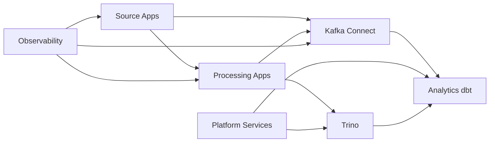
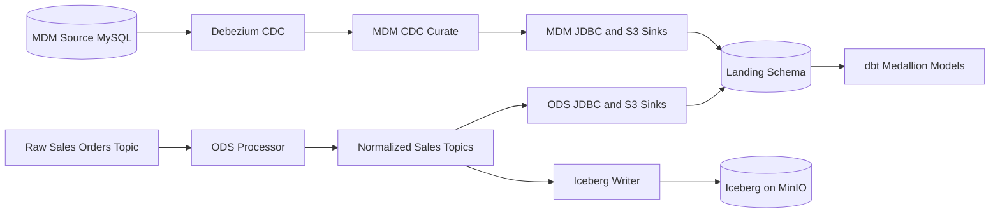

# Full Stack Modern Data Architecture and Engineering

A reference implementation of a production-grade modern data platform covering realtime event streaming, CDC-driven MDM, a lakehouse on object storage, medallion ELT modeling, workflow orchestration, and GitOps delivery — all runnable locally with two operating modes:

- **Routine A** — Docker Compose for fast development loops.
- **Routine B** — kind + Helm + Argo CD for Kubernetes and GitOps workflow simulation.

## Table of Contents

- [What This Project Demonstrates](#what-this-project-demonstrates)
- [End-to-End Flow](#end-to-end-flow-high-level)
- [Repository Layout](#repository-layout)
- [Quick Start — Option A: Docker Compose](#option-a-compose-routine-a)
- [Quick Start — Option B: kind + Helm + Argo CD](#option-b-kind--helm--argo-cd-routine-b)
- [Environment Strategy](#environment-strategy)
- [Configuration](#configuration)
- [Data Validation](#data-validation)
- [Validation Snapshot](#validation-snapshot-2026-04-20)
- [Complete Tooling Inventory](#complete-tooling-inventory)
- [Lakehouse/Warehouse Target Options](#lakehousewarehouse-target-options)
- [Build Commands](#build-commands)
- [Documentation Map](#documentation-map)
- [Subproject READMEs](#subproject-readmes)
- [Notes](#notes)

## What This Project Demonstrates

- Kafka as a realtime event backbone.
- Flink stream processing embedded in a Java Spring Boot service.
- CDC-driven MDM integration with MySQL + Debezium.
- MinIO-backed lakehouse object storage, with Trino added as the query engine path for Iceberg-compatible tables.
- Warehouse-style analytics on Postgres for local development, with portable patterns for Redshift, Snowflake, BigQuery, and Databricks.
- dbt ELT with medallion layers (landing -> bronze -> silver -> gold).
- Airflow orchestration for scheduled model refresh.
- Docker/Kubernetes runtime and Helm/Argo CD automation.

## Lakehouse/Warehouse Target Options

This repository runs locally on Postgres + MinIO by default, but the same architecture pattern can be implemented on:

- Amazon Redshift
- Snowflake
- Google BigQuery
- Databricks

MinIO migration note:

- MinIO is used as a local S3-compatible object store.
- Cloud counterparts are Amazon S3 (AWS), Google Cloud Storage (GCP), and Azure Data Lake Storage Gen2 (Azure).

Portability guidance:

- Keep Kafka topic contracts and medallion model intent unchanged.
- Use environment-specific dbt profiles and adapter packages per target platform.
- Replace sink connectors and storage integrations to match the selected warehouse/lakehouse stack.
- Preserve dimensional model semantics (conformed dimensions and facts) across platforms.

Current implementation note:

- The current MinIO connector path writes raw JSON objects through the Kafka Connect S3 sink.
- Trino is now added as the query engine foundation, and this repository now includes a Trino-managed bootstrap path that materializes real Iceberg tables on MinIO from the Postgres `landing` layer.
- A direct Kafka-to-Iceberg writer service is also included and writes realtime topics into Iceberg tables through Trino.

### Concrete Migration Matrix (Quick Reference)

| Target | Connector change | dbt adapter | Key config changes |
| --- | --- | --- | --- |
| Redshift | Use Redshift sink pattern (direct connector or S3 staging + COPY) | `dbt-redshift` | Redshift endpoint/db/schema plus IAM/COPY settings |
| Snowflake | Use Snowflake Kafka Connector | `dbt-snowflake` | Account/role/warehouse/database/schema and auth method |
| BigQuery | Use BigQuery Sink connector | `dbt-bigquery` | Project/dataset/location and service account auth |
| Databricks | Use Delta sink pattern for Databricks tables | `dbt-databricks` | SQL warehouse host/http_path/token and catalog/schema |

Object storage counterpart by cloud:

| Cloud | Object storage |
| --- | --- |
| AWS | Amazon S3 |
| GCP | Google Cloud Storage |
| Azure | Azure Data Lake Storage Gen2 |

For full migration detail and workflow, see [docs/architecture.md](docs/architecture.md).

### Fast Links to New Migration Sections

- Sample .env onboarding blocks per platform: [docs/architecture.md - 3.3 Sample Environment Variable Blocks (.env Style)](docs/architecture.md#33-sample-environment-variable-blocks-env-style)
- Cloud Kubernetes migration candidates (AWS/GCP/Azure): [docs/architecture.md - 8.3 Cloud Kubernetes Migration Candidates](docs/architecture.md#83-cloud-kubernetes-migration-candidates)

## End-to-End Flow (High Level)

1. Python producer publishes composite sales events to `raw_sales_orders`.
2. Java/Flink processor consumes and fans out into `sales_order`, `sales_order_line_item`, and `customer_sales` topics.
3. Kafka Connect sinks these topics to raw JSON objects on MinIO and Postgres landing tables.
4. MDM writer updates MySQL customer and product master records.
5. Debezium captures MDM CDC; CDC publisher emits curated `mdm_customer` and `mdm_product` topics.
6. PySpark sync moves MDM tables into Postgres landing.
7. dbt builds bronze, silver, and gold analytics models.
8. Trino can bootstrap and query real Iceberg tables on MinIO from the Postgres `landing` layer.
9. `iceberg-writer` can write Kafka topics directly into Iceberg tables through Trino without using the Postgres bridge.
10. Airflow schedules recurring dbt runs.

## Component Diagram



## Data Flow Diagram



## Documentation Map

| Document | Purpose |
| --- | --- |
| [docs/architecture.md](docs/architecture.md) | Architecture diagrams and modern data engineering framework/patterns |
| [docs/runbook.md](docs/runbook.md) | Day-2 operations procedures for Compose and Argo CD workflows |
| [docs/adr/README.md](docs/adr/README.md) | Architecture Decision Records (ADRs) |

## Subproject READMEs

| Subproject | README |
| --- | --- |
| Source applications | [source-apps/readme.md](source-apps/readme.md) |
| Processing applications | [process-apps/readme.md](process-apps/readme.md) |
| Kafka Connect integration | [kafka-connect/readme.md](kafka-connect/readme.md) |
| Platform services | [platform-services/readme.md](platform-services/readme.md) |
| CI/CD and GitOps | [cicd/readme.md](cicd/readme.md) |
| Analytics | [analytics/readme.md](analytics/readme.md) |
| Trino integration | [trino/readme.md](trino/readme.md) |
| Observability stack | [observability/readme.md](observability/readme.md) |

## Complete Tooling Inventory

The table below lists the tooling used across local runtime, data processing, orchestration, deployment, and observability.
Versions are shown when they are explicitly pinned in this repository.

| Category | Tooling used in this project |
| --- | --- |
| Container and local runtime | Docker Compose, Dockerfiles for service images, Makefile-driven workflows |
| Kubernetes and GitOps | kind, kubectl, Helm (chart: `vision`), Argo CD |
| Streaming backbone | Apache Kafka `3.7.1`, Kafka UI `v0.7.2` |
| Stream processing application | Java `17`, Spring Boot `3.2.6`, Apache Flink `1.19.1`, Flink Kafka connector `3.2.0-1.19`, Maven |
| Data integration and CDC | Kafka Connect (Confluent Platform image `7.6.1`), Debezium Connect `3.0`, JDBC and S3 sink connectors |
| Object storage and lakehouse path | MinIO, Trino `472`, Iceberg-compatible table path via Trino catalog configuration |
| Databases | PostgreSQL `16`, MySQL `8.4` |
| ELT and analytics modeling | dbt with `dbt-postgres==1.8.2` and `dbt-trino==1.8.2` |
| Workflow orchestration | Apache Airflow `2.10.5` (Python `3.11`) |
| Python services | Python `>=3.11`, `kafka-python==2.0.2`, `mysql-connector-python==9.0.0`, Hatchling build backend |
| Spark-based sync | PySpark job (`spark-submit`) for MDM to Postgres sync |
| Observability and monitoring | Prometheus `v3.2.1`, Grafana `11.5.2`, Blackbox Exporter `v0.27.0` |
| SQL operations and validation | Trino SQL scripts, bootstrap and incremental SQL scripts, Make targets for health and smoke checks |

Related source locations:

- Runtime services: [compose.yml](compose.yml)
- Build and ops entrypoints: [Makefile](Makefile)
- Kubernetes and GitOps artifacts: [cicd/charts/Chart.yaml](cicd/charts/Chart.yaml), [cicd/argocd/dev.yaml](cicd/argocd/dev.yaml)
- dbt project and adapter setup: [analytics/dbt/Dockerfile](analytics/dbt/Dockerfile), [analytics/dbt/dbt_project.yml](analytics/dbt/dbt_project.yml)
- Processor stack: [process-apps/ods_processor/pom.xml](process-apps/ods_processor/pom.xml)
- Observability provisioning: [observability/prometheus/prometheus.yml](observability/prometheus/prometheus.yml), [observability/grafana/provisioning/datasources/prometheus.yml](observability/grafana/provisioning/datasources/prometheus.yml)

## Repository Layout

- `compose.yml`: Local Routine A service topology for the full stack.
- `Makefile`: Unified operational entrypoints for build, run, validation, and troubleshooting flows.
- `source-apps/`: Source-side applications.
- `source-apps/ods_source`: Python Kafka producer for composite sales orders.
- `source-apps/mdm-source`: MySQL-backed MDM source system simulator for CDC testing.
- `process-apps/`: Downstream processing and synchronization applications.
- `process-apps/ods_processor`: Spring Boot application that launches the Flink topology.
- `process-apps/mdm-cdc-curate`: Python app that consumes Debezium CDC topics and publishes `mdm_customer` and `mdm_product`.
- `process-apps/mdm-pyspark-sync`: PySpark app that continuously syncs MySQL MDM tables into Postgres landing tables.
- `process-apps/iceberg-writer`: Python service that consumes Kafka topics and writes directly to Iceberg tables through Trino.
- `kafka-connect/`: Kafka Connect images and connector configurations.
- `platform-services/`: Platform support images and bootstrap assets.
- `platform-services/airflow`: Apache Airflow image and DAGs for scheduled dbt orchestration.
- `platform-services/metadata`: OpenMetadata workflow definitions and metadata-service support assets.
- `platform-services/schemas`: Schema Registry bootstrap image and Avro schema assets.
- `analytics/dbt`: dbt project for bronze, silver, and gold models targeting Trino and the Compose Postgres warehouse (`snowflake-mimic`).
- `analytics/sql`: Postgres bootstrap SQL for landing and MDM sync targets.
- `source-apps/mdm-source/sql`: MySQL bootstrap SQL for MDM `customer360` and `product_master` tables.
- `trino/etc`: Trino coordinator and catalog configuration.
- `trino/sql`: Trino bootstrap and incremental lakehouse SQL scripts.
- `observability`: Prometheus, Grafana, and Blackbox Exporter configuration and dashboards.
- `cicd/charts`: Helm chart for Routine B Kubernetes deployment.
- `cicd/k8s/helm/values`: Helm values for `dev`, `qa`, and `prd`.
- `cicd`: CI/CD and GitOps assets, including Argo CD manifests, Helm charts, and Kubernetes helpers.
- `scripts`: Local bootstrap, image build, topic, and query helpers.
- `docs/architecture.md`: Architecture diagrams and modern data engineering framework/patterns.
- `docs/runbook.md`: Day-2 operations procedures for Compose and Argo CD workflows.
- `docs/adr`: Architecture Decision Records (ADRs).

## Option A: Docker Compose (Routine A)

All local development, validation, and troubleshooting flows are now consolidated under unified scripts and Make targets. **Deprecated scripts will print a warning and exit.**

### Start the Full Stack (Routine A)

```bash
make compose-up
```

Build images explicitly when needed:

```bash
make compose-build
```

Run Docker Compose directly (equivalent runtime path):

```bash
docker compose up -d --build
```

### Validate and Operate

```bash
make mdm-status
make mdm-topics-check
make mdm-flow-check
```

### Common Operations

| Command | Purpose |
| --- | --- |
| `make compose-build` | Build all runtime images |
| `make compose-up` | Start the compose stack |
| `make compose-down` | Stop the compose stack |
| `make compose-clean` | Remove compose resources and prune unused Docker artifacts |
| `make mdm-status` | Check MDM CDC service and Debezium connector status |
| `make mdm-topics-check` | Consume sample curated MDM topic records |
| `make mdm-flow-check` | Run combined MDM status plus topic validation |

### Endpoints

| Service | Endpoint |
| --- | --- |
| Kafka | `localhost:9094` |
| Kafka UI | `http://localhost:8080` |
| MinIO API | `http://localhost:9000` |
| MinIO Console | `http://localhost:9001` |
| Kafka Connect REST | `http://localhost:8083` |
| Debezium Connect REST (MDM) | `http://localhost:8085` |
| Trino coordinator | `http://localhost:8086` |
| Airflow UI | `http://localhost:8084` |
| Postgres | `localhost:5432` (user/password/db: `analytics`) |
| MySQL MDM | `localhost:3306` (root password: `mdmroot`, db: `mdm`) |

OpenMetadata is not part of the default routine. It is available only when running the optional Compose profile: `docker compose --profile openmetadata up -d`.

### Container Behavior

- One-shot init containers (`kafka-init`, `schema-init`, `minio-init`, `dbz-connect-init`, `ods-connect-init`, `mdm-connect-init`) and `dbt` will exit with code 0 after completion.
- Trino may start successfully even if no Iceberg tables exist yet (expected until MinIO sink path is upgraded).

### Troubleshooting FAQ

- **Port already in use?** Run `docker compose down -v` before restarting.
- **Volumes not resetting?** Use `docker compose down -v` to clear all volumes.
- **Healthcheck failures?** Check logs with `docker compose logs <service>`.
- **dbt container exited?** This is normal after a successful run; check dbt logs for errors.
- **No data in gold/silver models?** Ensure upstream topics and Iceberg tables are populated and dbt has run.

---

## Option B: kind + Helm + Argo CD (Routine B)

For Kubernetes/GitOps simulation, use:

```bash
./cicd/k8s/kind/bootstrap-kind.sh
```

See [docs/runbook.md](docs/runbook.md) for full Routine B and k8s flows.

Bootstrap local cluster via Argo CD app:

```bash
./cicd/scripts/build-images.sh
kubectl apply -f cicd/argocd/dev.yaml
```

Stop local cluster workloads:

```bash
kubectl -n argocd delete application edw-dev || true
kubectl delete namespace edw-dev || true
```

Run unified day-2 operations (Docker-path parity):

```bash
kubectl -n argocd get application edw-dev
kubectl -n edw-dev get pods
```

Recommended command order (matches the runbook):

1. Create kind cluster and install Argo CD:

   ```bash
   ./cicd/k8s/kind/bootstrap-kind.sh
   ```

2. Build and load local images into kind:

   ```bash
   ./cicd/scripts/build-images.sh
   ```

3. Apply Argo CD application:

   ```bash
   kubectl apply -f cicd/argocd/dev.yaml
   ```

   If the Argo CD UI does not show `edw-dev`, re-apply and validate:

   ```bash
   kubectl apply -f cicd/argocd/dev.yaml
   kubectl -n argocd get application edw-dev
   ```

4. Validate app and workloads:

   ```bash
   kubectl -n argocd get pods
   kubectl -n argocd get applications
   kubectl -n edw-dev get pods
   ```

   If Argo CD shows `SYNC STATUS: Unknown` with a `ComparisonError` about repository access,
   register Git credentials in Argo CD for the configured source repo in `cicd/argocd/dev.yaml`.
   You can still validate local chart changes immediately with direct Helm commands:

   ```bash
   make helm-reboot-dev
   make helm-health-dev
   ```

5. Run cluster validation checks:

   ```bash
   kubectl -n argocd get application edw-dev
   kubectl -n edw-dev get pods
   kubectl -n edw-dev get jobs
   ```

6. Validate processor pipeline logs:

   ```bash
   kubectl -n edw-dev get pods
   kubectl -n edw-dev logs deploy/edw-dev-vision-processor --tail=100
   ```

7. Validate dbt and Airflow logs:

   ```bash
   kubectl -n edw-dev get pods
   kubectl -n edw-dev logs job/edw-dev-vision-dbt --tail=100
   kubectl -n edw-dev logs deploy/edw-dev-vision-airflow --tail=100
   kubectl -n edw-dev port-forward svc/edw-dev-vision-airflow 8084:8080
   kubectl -n edw-dev port-forward svc/edw-dev-vision-minio 9001:9001
   ```

8. Port-forward local access (same UI order as runbook):

   ```bash
   kubectl -n argocd port-forward svc/argocd-server 8443:443
   kubectl -n edw-dev port-forward svc/edw-dev-vision-kafka-ui 8082:8080
   kubectl -n edw-dev port-forward svc/edw-dev-vision-grafana 3001:3000
   kubectl -n edw-dev port-forward svc/edw-dev-vision-airflow 8084:8080
   kubectl -n edw-dev port-forward svc/edw-dev-vision-minio 9001:9001
   kubectl -n edw-dev port-forward svc/edw-dev-vision-trino 8086:8080
   kubectl -n edw-dev port-forward svc/edw-dev-vision-postgres 5433:5432
   ```

   | Service | URL / Connection |
   | --- | --- |
   | Argo CD | `https://localhost:8443` (username: `admin`) |
   | Argo CD password | `kubectl -n argocd get secret argocd-initial-admin-secret -o jsonpath='{.data.password}' \| base64 --decode; echo` |
   | Kafka UI | `http://localhost:8082` |
   | Grafana | `http://localhost:3001` |
   | Airflow | `http://localhost:8084` (user/password: `admin` / `admin`) |
   | MinIO Console | `http://localhost:9001` (user: `minio`, password: `minio123`) |
   | Trino | `http://localhost:8086` |
   | Postgres | host `127.0.0.1`, port `5433`, user `analytics`, password `analytics`, db `analytics` |

Dev environment behavior:

- Uses in-cluster Kafka from the Helm dependency (`kafka.enabled=true` in `environments/dev/values.yaml`).
- Uses locally built producer, processor, Kafka Connect, dbt, and Airflow images already loaded into kind (`imagePullPolicy: Never`).
- Deploys MinIO, Trino, Postgres, Kafka Connect, a one-shot dbt bootstrap Job, and Airflow in the same Helm release.
- Argo CD tracks `https://github.com/paulchen8206/Full-Stack-Modern-Data-Architecture-and-Engineering.git` on branch `main` and syncs `cicd/charts` with `environments/dev/values.yaml`.

## Environment Strategy

| Environment | Description |
| --- | --- |
| `dev` | Local kind deployment with in-cluster Kafka from the Helm dependency. |
| `qa` | GitOps deployment against a shared Kafka bootstrap service and registry-hosted images. |
| `prd` | Same logical topology as `qa` with higher replica counts and faster Flink checkpoints. |

## Configuration

### Producer

- `KAFKA_BOOTSTRAP_SERVERS`: Kafka bootstrap servers.
- `RAW_TOPIC`: Source topic name. Default is `raw_sales_orders`.
- `PRODUCER_INTERVAL_MS`: Publish interval in milliseconds.

### Processor

- `KAFKA_BOOTSTRAP_SERVERS`: Kafka bootstrap servers.
- `APP_RAW_SALES_ORDERS_TOPIC`: Source topic.
- `APP_SALES_ORDER_TOPIC`: Sink topic for order headers.
- `APP_SALES_ORDER_LINE_ITEM_TOPIC`: Sink topic for order line items.
- `APP_CUSTOMER_SALES_TOPIC`: Sink topic for per-customer aggregates.
- `APP_CONSUMER_GROUP_ID`: Kafka consumer group.
- `APP_CHECKPOINT_INTERVAL_MS`: Flink checkpoint interval.

### Kafka Connect and Lakehouse Layer

- `ods-connect` service runs S3 sink connectors for `sales_order`, `sales_order_line_item`, and `customer_sales` into MinIO object storage.
- `ods-connect` service also runs a JDBC sink connector for the same topics into Postgres `landing` schema.
- Connector registration happens automatically in `ods-connect-init` in Compose and via a Kubernetes Job in the Helm release.

### Trino Query Engine

- `trino` exposes a SQL query engine endpoint for MinIO-backed Iceberg-compatible data.
- Local Compose endpoint: `http://localhost:8086`
- Kubernetes endpoint: port-forward `svc/edw-dev-vision-trino 8086:8080`
- The repository includes a repeatable SQL runner: `python3 trino/scripts/trino_query.py --server http://localhost:8086 --file <sql-file>`
- The repository also includes a shell helper for ad hoc SQL without calling Python directly: `./trino/scripts/trino-sql.sh "SHOW TABLES FROM lakehouse.streaming"`
- `make trino-shell` opens the Trino CLI inside the Compose service, or runs a SQL file when `SQL_FILE=<path>` is provided
| Make target | Action |
| --- | --- |
| `make trino-bootstrap-lakehouse` | Materialize real Iceberg tables from Postgres landing |
| `make trino-rebuild-lakehouse` | Drop and recreate all demo Iceberg tables |
| `make trino-sync-lakehouse` | Incremental refresh from Postgres landing |
| `make trino-seed-demo` | Create demo seed tables |
| `make iceberg-streaming-smoke` | End-to-end verification for the direct writer path |
| `make iceberg-streaming-smoke-dev` | Kubernetes-side verification via temporary Trino port-forward |

Example Trino workflow:

```sql
SHOW CATALOGS;
SHOW SCHEMAS FROM lakehouse;
SHOW TABLES FROM lakehouse.demo;
```

Example current Trino-managed Iceberg workflow:

```sql
CREATE SCHEMA IF NOT EXISTS lakehouse.demo
WITH (location = 's3://warehouse/iceberg/demo');

CREATE TABLE IF NOT EXISTS lakehouse.demo.sample_orders (
   order_id VARCHAR,
   customer_id VARCHAR,
   order_total DOUBLE,
   order_ts TIMESTAMP
)
WITH (
   format = 'PARQUET',
   location = 's3://warehouse/iceberg/demo/sample_orders'
);

SELECT * FROM lakehouse.demo.sample_orders LIMIT 10;
```

### Direct Kafka-to-Iceberg Writer

- `iceberg-writer` consumes `sales_order`, `sales_order_line_item`, and `customer_sales` directly from Kafka.
- It batches records topic by topic before issuing Trino `MERGE` statements.
- It also uses a timed flush so low-volume topics are written even before a batch fills.
- It creates and maintains Iceberg tables in `lakehouse.streaming` through Trino.
- This removes the Postgres bridge for the realtime lakehouse path, while keeping Postgres available for dbt and warehouse modeling.

### MDM CDC Layer

- `mdm-source` stores MDM entities:
  - `mdm.customer360` aligned to customer dimension semantics.
  - `mdm.product_master` aligned to product dimension semantics.
- `mdm-source` continuously inserts and updates those master records through its built-in data generator.
- `dbz-connect` runs Debezium MySQL source connector (`dbz-mysql-mdm`).
- Debezium raw CDC topics:
  - `mdm_mysql.mdm.customer360`
  - `mdm_mysql.mdm.product_master`
- `mdm-cdc-curate` consumes raw CDC and republishes curated MDM topics:
  - `mdm_customer`
  - `mdm_product`
- `mdm-connect` runs MDM sink connectors to downstream stores.
- `mdm-pyspark-sync` periodically reads MySQL MDM source tables and writes them into Postgres `landing.mdm_customer360`, `landing.mdm_product_master`, and `landing.mdm_date`.

### dbt and Warehouse Layer

- dbt project location: `analytics/dbt`
- The dbt model structure is portable to Redshift, Snowflake, BigQuery, and Databricks by switching adapter/profile configuration.

| Layer | Schema | Materialization |
| --- | --- | --- |
| Source | `landing` | — |
| Bronze | `bronze` | views |
| Silver | `silver` | tables |
| Gold | `gold` | tables |

- `analytics/dbt/macros/generate_schema_name.sql` disables dbt's default `target_schema + custom_schema` concatenation, so models materialize directly in `bronze`, `silver`, and `gold`.
- In the Helm path, the same macro must be mounted into the dbt runtime (`/dbt/macros/generate_schema_name.sql`) from the warehouse ConfigMap; otherwise dbt may recreate `public_bronze`, `public_silver`, and `public_gold`.
- Main gold model: `gold_customer_sales_summary`

### Airflow Scheduling Layer

- Airflow DAG location: `platform-services/airflow/dags/dbt_warehouse_schedule.py`
- DAG ID: `dbt_warehouse_schedule`
- Schedule: every 5 minutes
- The DAG runs `dbt deps` and `dbt run` against both Trino and the local Compose Postgres warehouse service (`snowflake-mimic`)
- In the dev Helm path, Airflow runs inside the same release and serves its UI through the `edw-dev-vision-airflow` service

## Data Validation

Run these checks after startup to validate each pipeline layer.

Validate Kafka topic fan-out:

```bash
docker compose exec kafka-3 /usr/bin/kafka-console-consumer --bootstrap-server kafka-3:19094 --topic raw_sales_orders --max-messages 1 --timeout-ms 15000
docker compose exec kafka-3 /usr/bin/kafka-console-consumer --bootstrap-server kafka-3:19094 --topic sales_order --max-messages 1 --timeout-ms 15000
docker compose exec kafka-3 /usr/bin/kafka-console-consumer --bootstrap-server kafka-3:19094 --topic sales_order_line_item --max-messages 1 --timeout-ms 15000
docker compose exec kafka-3 /usr/bin/kafka-console-consumer --bootstrap-server kafka-3:19094 --topic customer_sales --max-messages 1 --timeout-ms 15000
```

Validate landing, bronze, silver, and gold row counts in Postgres:

```bash
docker compose exec -T snowflake-mimic psql -U analytics -d analytics -c "SELECT count(*) AS landing_sales_order FROM landing.sales_order; SELECT count(*) AS landing_sales_order_line_item FROM landing.sales_order_line_item; SELECT count(*) AS landing_customer_sales FROM landing.customer_sales;"
```

Rerun dbt manually if needed:

```bash
docker compose run --rm dbt
```

Start Airflow for scheduled runs:

```bash
docker compose up -d --build airflow
```

> `docker compose run --rm dbt` may briefly wait on dependencies before the dbt command starts.

## Validation Snapshot (2026-04-20)

The following checks were validated against the current workspace and local dev cluster state.

Static validation:

- `docker compose config` rendered successfully.
- `helm dependency build cicd/charts` completed successfully.
- `helm template edw-dev cicd/charts -f environments/dev/values.yaml` rendered successfully.

Runtime validation (Routine A — Docker Compose):

- `make compose-up` completed successfully. Core containers were Running and one-shot init/dbt containers exited with code 0.
- Landing row counts were confirmed in `snowflake-mimic` for `landing.sales_order`, `landing.sales_order_line_item`, and `landing.customer_sales`.
- Trino coordinator endpoint check passed: `curl -fsS http://localhost:8086/v1/info | cat`.
- Curated MDM topic checks passed via `make mdm-topics-check`.
- `make mdm-topics-check` consumed records from `mdm_customer` and `mdm_product`.
- Airflow UI reachable at `http://localhost:8084` after `docker compose up -d --build airflow`.
- OpenMetadata hardening checks passed after enabling query stats and local schema registry: `docker compose up -d snowflake-mimic schema-registry`, `make openmetadata-ingest-postgres` completed with `GetQueries` passed, and `make openmetadata-ingest-kafka` completed with `CheckSchemaRegistry` passed and Kafka workflow `Warnings: 0`.

Runtime validation (Routine B cluster — 2026-04-18):

- `kubectl -n argocd get application edw-dev` reported `SYNC=Synced`, `HEALTH=Healthy`.
- `kubectl -n edw-dev get pods` showed core workloads in `Running`.
- `kubectl -n edw-dev get jobs` confirmed initialization jobs completed.
- `kubectl -n edw-dev logs deploy/edw-dev-vision-mdm-cdc-curate --tail=100` showed curated MDM topic publication.
- `kubectl -n edw-dev logs deploy/edw-dev-vision-iceberg-writer --tail=100` showed streaming Iceberg writes.

Important GitOps note:

- If Argo CD owns the release, treat Git as source of truth and sync through Argo CD after committing chart changes.
- If the app is missing in Argo CD UI, re-apply `cicd/argocd/dev.yaml` and validate with `kubectl -n argocd get application edw-dev`.

## Build Commands

Build the Java processor jar:

```bash
cd processor
mvn -DskipTests package
```

Run the producer directly:

```bash
cd producer
uv sync
uv run producer
```

## Notes

- `qa` and `prd` values assume Kafka already exists and is reachable at the configured bootstrap service address.
- The Flink job is embedded in the Spring Boot process for a simple local and GitOps deployment model.
