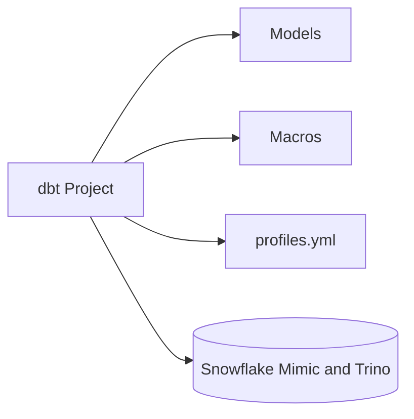
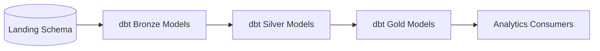

# Analytics dbt Project

This directory contains the dbt (Data Build Tool) project for the GenAI-Enabled Data Platform.

## What is dbt?
dbt (Data Build Tool) is an open-source command-line tool that enables data analysts and engineers to transform data in their warehouse more effectively. It allows you to write modular SQL queries, test data quality, and document your data models, all while following software engineering best practices like version control and CI/CD.

## Key Features
- **SQL-based transformations**: Write models as SQL SELECT statements.
- **Modularity**: Build complex transformations from simple, reusable models.
- **Testing**: Define and run data quality tests on your models.
- **Documentation**: Auto-generate documentation for your data models and lineage.
- **Version Control**: Integrate with Git for collaborative development.

## Project Structure
- `dbt_project.yml`: Main dbt project configuration.
- `models/`: Contains all dbt models (SQL transformations).
- `macros/`: Custom dbt macros for reusable SQL logic.
- `logs/`: dbt run logs.
- `target/`: Compiled models and run artifacts.
- `profiles.yml`: dbt connection profiles (usually symlinked or mounted).

## Component Diagram

## Data Flow Diagram

## Getting Started
1. Install dbt (see [dbt documentation](https://docs.getdbt.com/docs/installation)).
2. Configure your `profiles.yml` for your data warehouse.
3. Run `dbt run` to build models.
4. Run `dbt test` to validate data quality.
5. Use `dbt docs generate && dbt docs serve` to view documentation.

For more details, see the official [dbt documentation](https://docs.getdbt.com/).
