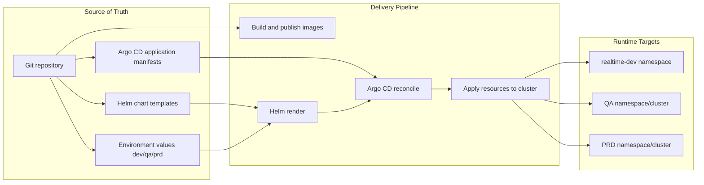

# CI/CD and GitOps

This sub-project contains deployment and promotion assets for local Kubernetes simulation and cloud-oriented GitOps workflows.

## Overview

The `cicd` folder is the delivery control plane for this repository. It includes:

- Argo CD Application manifests per environment (`dev`, `qa`, `prd`)
- Helm chart templates for the platform runtime
- Environment-specific values files
- Local cluster bootstrap scripts for kind
- Helper scripts for image build and connector/schema registration

## Folder Structure

- `argocd/`
  - `dev.yaml`
  - `qa.yaml`
  - `prd.yaml`
- `charts/realtime-app/`
  - `Chart.yaml`
  - `values.yaml`
  - `templates/`
  - `charts/`
- `k8s/helm/`
  - `values/values-dev.yaml`
  - `values/values-qa.yaml`
  - `values/values-prd.yaml`
  - `scripts/helm-deps.sh`
- `k8s/kind/`
  - `bootstrap-kind.sh`
- `scripts/`
  - `build-images.sh`
  - `register-connectors.sh`
  - `consolidated-register-connector.sh`
  - `register-schemas.sh`

## Deployment Model

1. Build and publish/load images for runtime services.
2. Render and deploy the Helm chart (`charts/realtime-app`) with environment values.
3. Reconcile desired state through Argo CD Application manifests.
4. Validate workloads and runtime health with runbook checks.

## Left-To-Right GitOps Pipeline



## Usage

Use the script and kubectl entrypoints for local GitOps operation:

```bash
./cicd/k8s/kind/bootstrap-kind.sh
./cicd/scripts/build-images.sh
kubectl apply -f cicd/argocd/dev.yaml
kubectl -n argocd get application realtime-dev
```

For direct Argo CD app reconciliation:

```bash
kubectl apply -f cicd/argocd/dev.yaml
kubectl -n argocd get application realtime-dev
```

For chart-level validation, use Helm directly with the chart and values files in this folder.

## Notes

- Keep environment differences in values files, not in templates.
- Treat Git as source of truth when Argo CD is enabled.
- Use runbook validation steps before promoting from `dev` to `qa` and `prd`.

## References

- `../docs/runbook.md`
- `../docs/architecture.md`
- `../readme.md`
