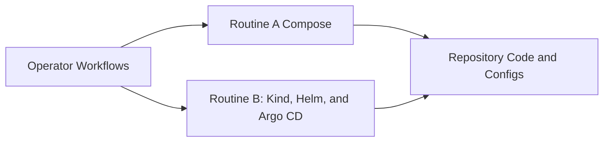
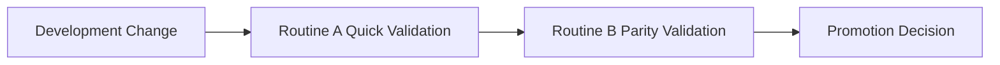

# ADR-0001: Dual Local Runtime Strategy (Compose and kind + Helm + Argo CD)

- Status: Accepted
- Date: 2026-04-18

## 1. Summary

The platform supports two first-class local runtime modes: Docker Compose for rapid iteration and kind + Helm + Argo CD for GitOps-oriented parity validation.

## 2. Context

A single local runtime mode does not satisfy both needs:

- fast feedback for daily development
- Kubernetes and GitOps workflow rehearsal before environment promotion

Teams need a quick inner loop and a deployment-like rehearsal path in the same repository.

## 3. Decision

Adopt a dual runtime strategy:

- Routine A: Docker Compose as the default local development runtime
- Routine B: kind cluster plus Helm charts plus Argo CD application reconciliation for GitOps-style validation

Both paths are officially supported and documented.

## 4. Operational References

Routine A baseline commands:

- make compose-up
- make compose-down
- make mdm-flow-check

Routine B baseline sequence:

- ./cicd/k8s/kind/bootstrap-kind.sh
- ./cicd/scripts/build-images.sh
- kubectl apply -f cicd/argocd/dev.yaml

## 5. Validation

Validation is successful when:

- Compose services start and pass flow checks
- kind + Argo CD path deploys workloads successfully
- documentation remains consistent across both routines

## 6. Consequences

Positive outcomes:

- faster day-to-day coding loop
- better production-style rollout simulation

Trade-offs:

- two operational paths to maintain
- greater documentation drift risk if updates are not synchronized

## 7. Alternatives Considered

- Compose only: rejected due to lack of Kubernetes/GitOps rehearsal
- Kubernetes only: rejected due to slower developer feedback loop

## 8. References

- [../runbook.md](../runbook.md)
- [../../readme.md](../../readme.md)
- [../../docker-compose.yml](../../docker-compose.yml)
- [../../cicd/argocd/dev.yaml](../../cicd/argocd/dev.yaml)

## 9. Diagrams

### 9.1 Component Diagram

### 9.2 Data Flow Diagram

