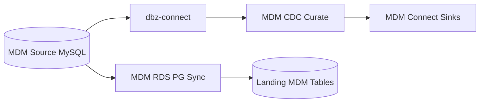

# ADR-0003: CDC-Driven MDM Master Data Propagation

- Status: Accepted
- Date: 2026-04-18

## 1. Summary

Master-data propagation uses a CDC-driven pipeline from MySQL source tables through Debezium into curated MDM Kafka topics and downstream landing synchronization.

## 2. Context

Customer and product master data must remain synchronized across streaming and analytics targets with low-latency updates and clear lineage.

Polling-only approaches are slower and less robust for change tracking.

## 3. Decision

Adopt this flow:

1. mdm-source MySQL stores master entities
2. dbz-connect captures row-level CDC events
3. mdm-cdc-curate republishes curated topics such as mdm_customer and mdm_product
4. mdm-rds-pg mirrors MDM source tables into Postgres landing schemas

## 4. Operational References

- make mdm-status
- make mdm-topics-check
- make mdm-flow-check
- kafka-connect/scripts/register-dbz-connectors.sh
- kafka-connect/scripts/register-mdm-connectors.sh

## 5. Validation

Validation is successful when:

- Debezium connector status is RUNNING
- curated MDM topics contain records
- downstream landing MDM tables receive synchronized rows

## 6. Consequences

Positive outcomes:

- near-real-time master-data propagation
- explicit separation of raw CDC and curated domain topics

Trade-offs:

- additional operational components to monitor
- connector health becomes a hard runtime dependency

## 7. Alternatives Considered

- batch-only sync: rejected due to freshness lag
- direct polling without CDC: rejected due to higher load and weaker change semantics

## 8. References

- [../runbook.md](../runbook.md)
- [../../kafka-connect/dbz-connect/connector-configs/dbz-mysql-mdm.json](../../kafka-connect/dbz-connect/connector-configs/dbz-mysql-mdm.json)
- [../../process-apps/mdm-cdc-curate](../../process-apps/mdm-cdc-curate)
- [../../process-apps/mdm-rds-pg](../../process-apps/mdm-rds-pg)

## 9. Diagrams

### 9.1 Component Diagram

### 9.2 Data Flow Diagram

