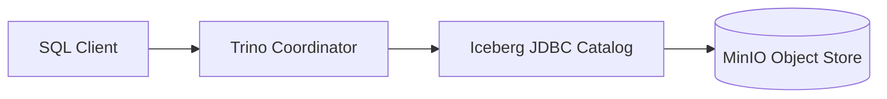
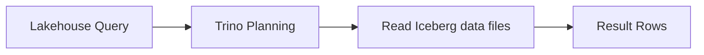

# ADR-0004: Trino Lakehouse Query Path on MinIO

- Status: Accepted
- Date: 2026-04-18

## 1. Summary

Trino is the primary SQL query path for MinIO-backed Iceberg lakehouse datasets in local runtime.

## 2. Context

The project requires a lakehouse query layer that supports open table semantics while remaining fully local and reproducible.

A direct object-store-only path is insufficient for governed SQL access and operational validation.

## 3. Decision

Adopt Trino as the query engine and entrypoint for lakehouse access.

Support two ingestion patterns:

- bridge path from landing tables into Iceberg
- direct streaming path through iceberg-writer into Iceberg

## 4. Operational References

- curl -fsS http://localhost:8086/v1/info | cat
- trino/scripts/trino-sql.sh "SHOW CATALOGS"
- trino/scripts/trino-sql.sh "SHOW SCHEMAS FROM lakehouse"
- trino/scripts/trino-sql.sh "SHOW TABLES FROM lakehouse.streaming"

## 5. Validation

Validation is successful when:

- Trino endpoint is reachable
- lakehouse catalog is visible
- streaming Iceberg tables are queryable
- table row counts increase under active data flow

## 6. Consequences

Positive outcomes:

- SQL-governed access to local lakehouse datasets
- unified analytics access layer

Trade-offs:

- metastore and catalog configuration complexity
- lakehouse path introduces additional operational dependencies

## 7. Alternatives Considered

- Postgres-only analytics path: rejected because it does not represent lakehouse behavior
- object storage sink without SQL query layer: rejected because validation and consumption are weaker

## 8. References

- [../architecture.md](../architecture.md)
- [../../trino/etc/catalog/lakehouse.properties](../../trino/etc/catalog/lakehouse.properties)
- [../../trino/sql](../../trino/sql)
- [../../process-apps/iceberg-writer](../../process-apps/iceberg-writer)

## 9. Diagrams

### 9.1 Component Diagram

### 9.2 Data Flow Diagram

