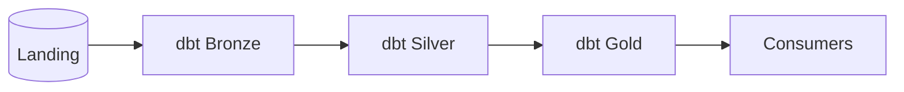
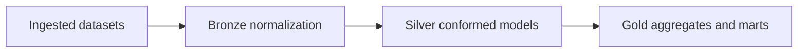

# ADR-0005: Medallion ELT Modeling with dbt

- Status: Accepted
- Date: 2026-04-18

## 1. Summary

The analytics model follows a medallion architecture using dbt: landing to bronze to silver to gold.

## 2. Context

Raw ingestion quality concerns and curated analytics concerns must be separated to support maintainability, testing, and lineage.

A flat SQL-script approach is harder to scale and govern.

## 3. Decision

Adopt dbt as the transformation framework for medallion layers:

- Landing: ingestion-owned raw tables
- Bronze: normalized staging views
- Silver: conformed facts and dimensions
- Gold: curated aggregates for consumption

## 4. Operational References

- make dbt-run
- docker compose exec -T snowflake-mimic psql -U analytics -d analytics -c "SELECT count(*) FROM landing.sales_order;"
- analytics/dbt/dbt_project.yml
- analytics/dbt/macros/generate_schema_name.sql

## 5. Validation

Validation is successful when:

- dbt runs complete without model errors
- target schemas bronze, silver, and gold are populated
- model outputs align with known source and business expectations

## 6. Consequences

Positive outcomes:

- clear data-layer separation
- repeatable SQL transformations under version control
- testable and portable model structure

Trade-offs:

- dbt runtime and artifact management become operational dependencies
- schema naming and macro behavior must remain consistent across runtime paths

## 7. Alternatives Considered

- single-schema transformation: rejected due to weak layer isolation
- hand-written SQL scripts only: rejected due to weaker testing and portability

## 8. References

- [../../analytics/dbt](../../analytics/dbt)
- [../../platform-services/airflow/dags/dbt_warehouse_schedule.py](../../platform-services/airflow/dags/dbt_warehouse_schedule.py)
- [../runbook.md](../runbook.md)

## 9. Diagrams

### 9.1 Component Diagram

### 9.2 Data Flow Diagram

