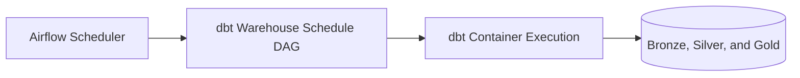
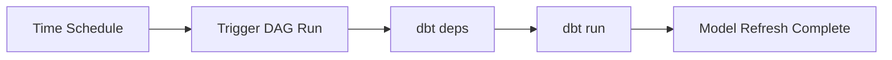

# ADR-0006: Airflow-Scheduled dbt Orchestration

- Status: Accepted
- Date: 2026-04-18

## 1. Summary

Apache Airflow is used to schedule recurring dbt runs for warehouse-transformation cadence.

## 2. Context

Manual dbt invocation does not provide reliable recurring refresh semantics or sufficient operational visibility for run history and retries.

## 3. Decision

Use a scheduled Airflow DAG to run dbt dependencies and dbt models on a fixed cadence.

DAG baseline:

- DAG ID: dbt_warehouse_schedule
- location: platform-services/airflow/dags/dbt_warehouse_schedule.py
- schedule: every 5 minutes

## 4. Operational References

- docker compose up -d --build airflow
- docker compose logs --tail=100 airflow
- docker compose exec airflow airflow dags list | grep dbt_warehouse_schedule

## 5. Validation

Validation is successful when:

- Airflow webserver and scheduler are healthy
- DAG is present and unpaused
- scheduled runs complete and refresh downstream medallion layers

## 6. Consequences

Positive outcomes:

- repeatable transformation cadence
- run-level observability and retry controls
- extensible orchestration entrypoint for future workflows

Trade-offs:

- additional runtime dependency
- scheduler and DAG health become mandatory for automatic refresh

## 7. Alternatives Considered

- host cron jobs: rejected due to weak portability and visibility
- no scheduler and manual dbt runs only: rejected due to operational fragility

## 8. References

- [../../platform-services/airflow/dags/dbt_warehouse_schedule.py](../../platform-services/airflow/dags/dbt_warehouse_schedule.py)
- [../../platform-services/airflow/start-airflow.sh](../../platform-services/airflow/start-airflow.sh)
- [../runbook.md](../runbook.md)

## 9. Diagrams

### 9.1 Component Diagram

### 9.2 Data Flow Diagram

