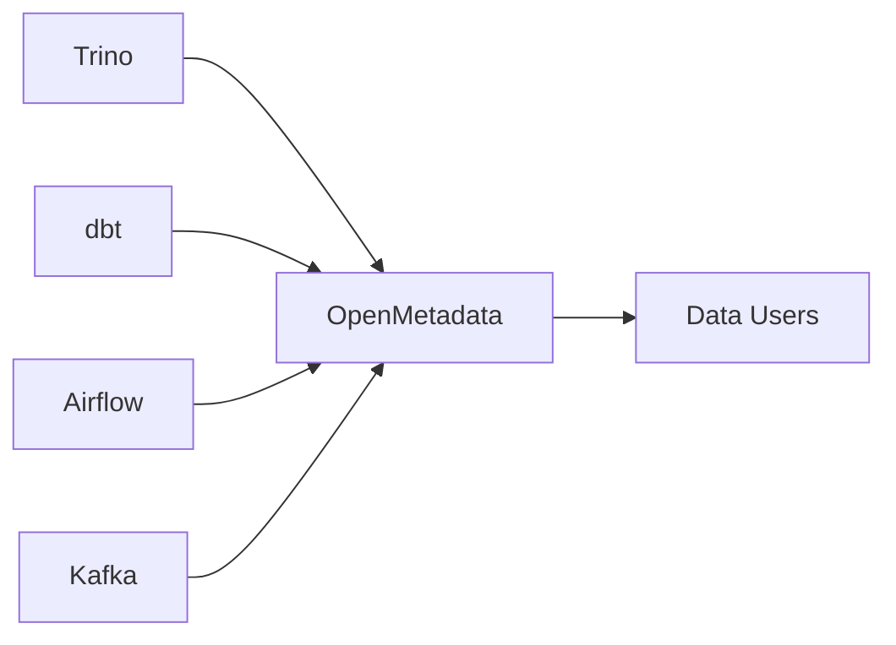
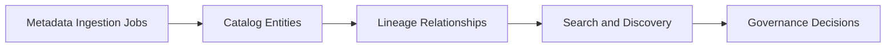

# ADR-0008: Unified Metadata Catalog with OpenMetadata

- Status: Proposed
- Date: 2026-04-20

## 1. Summary

This ADR proposes OpenMetadata as the unified metadata and lineage control plane for Trino, dbt, Airflow, and Kafka assets.

## 2. Context

Metadata is currently distributed across multiple service UIs and artifacts. This creates discovery and lineage friction for engineers and analysts.

A unified catalog is needed for:

- searchable entities
- cross-system lineage
- ownership and governance metadata

## 3. Decision

Adopt a phased OpenMetadata rollout in local runtime, then carry that pattern into promotion paths.

Phase scope:

1. bring up OpenMetadata server and ingestion runtime
2. ingest Trino entities and verify catalog coverage
3. ingest dbt and Airflow metadata for lineage depth
4. ingest Kafka entities for streaming context

## 4. Operational References

- docker compose up -d openmetadata-server openmetadata-ingestion
- curl -fsS http://localhost:8086/v1/info | cat
- trino/scripts/trino-sql.sh "SHOW CATALOGS"

## 5. Validation

Validation is successful when:

- key entities from Trino, dbt, Airflow, and Kafka appear in OpenMetadata
- lineage paths are consistent with architecture documentation
- ingestion workflows complete without fatal connector failures

## 6. Consequences

Expected positive outcomes:

- centralized metadata discovery
- stronger governance and lineage visibility

Expected trade-offs:

- added service and ingestion maintenance overhead
- naming consistency becomes stricter across systems

## 7. Alternatives Considered

- continue using isolated tool-specific UIs only: rejected for poor discoverability
- custom internal metadata index scripts: rejected for maintenance burden

## 8. References

- [../openmetadata-deployment-plan.md](../openmetadata-deployment-plan.md)
- [../../docker-compose.yml](../../docker-compose.yml)
- [0004-trino-lakehouse-query-path-on-minio.md](0004-trino-lakehouse-query-path-on-minio.md)
- [0005-medallion-elt-with-dbt.md](0005-medallion-elt-with-dbt.md)
- [0006-airflow-scheduled-dbt-orchestration.md](0006-airflow-scheduled-dbt-orchestration.md)
- [0007-unified-dbeaver-trino-query-surface.md](0007-unified-dbeaver-trino-query-surface.md)

## 9. Diagrams

### 9.1 Component Diagram

### 9.2 Data Flow Diagram

