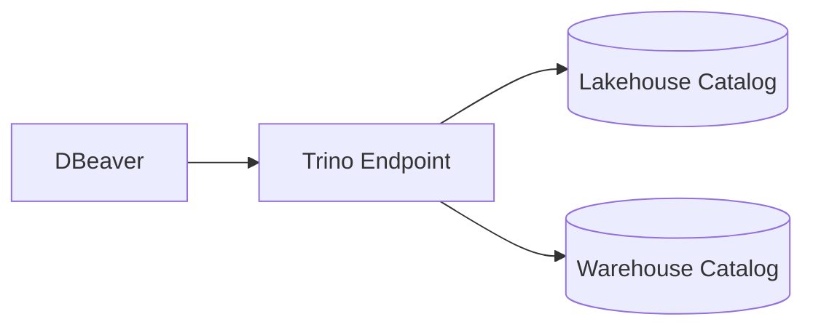
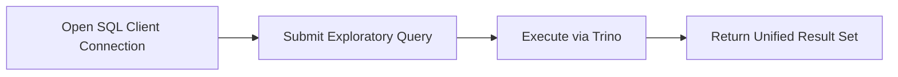

# ADR-0008: Unified DBeaver and Trino Query Surface

- Status: Accepted
- Date: 2026-04-20

## 1. Summary

DBeaver + Trino is the standard analyst-facing SQL access pattern across lakehouse and warehouse datasets.

## 2. Context

Using multiple direct clients for different storage backends increases onboarding time and reduces consistency in query-validation workflows.

ADR-0004 established Trino as the lakehouse query layer; this ADR standardizes the human-facing query experience.

## 3. Decision

Adopt one SQL access pattern:

- query through Trino endpoint at localhost:8086
- use DBeaver as the default interactive client
- keep script parity through trino/scripts/trino-sql.sh

## 4. Operational References

- curl -fsS http://localhost:8086/v1/info | cat
- trino/scripts/trino-sql.sh "SHOW CATALOGS"
- trino/scripts/trino-sql.sh "SHOW SCHEMAS FROM lakehouse"
- trino/scripts/trino-sql.sh "SHOW SCHEMAS FROM warehouse"

## 5. Validation

Validation is successful when:

- Trino connection from DBeaver succeeds
- lakehouse and warehouse catalogs are queryable
- scripted and GUI queries return consistent results

## 6. Consequences

Positive outcomes:

- reduced client fragmentation
- clearer onboarding for analysts and engineers
- consistent operational triage path

Trade-offs:

- Trino availability becomes critical for all SQL exploration
- catalog naming and governance discipline are required

## 7. Alternatives Considered

- separate direct client connections per backend: rejected due to fragmented workflows
- CLI-only query model: rejected due to weaker exploratory usability

## 8. References

- [0004-trino-lakehouse-query-path-on-minio.md](0004-trino-lakehouse-query-path-on-minio.md)
- [../../trino/etc/catalog/lakehouse.properties](../../trino/etc/catalog/lakehouse.properties)
- [../../trino/etc/catalog/warehouse.properties](../../trino/etc/catalog/warehouse.properties)
- [../runbook.md](../runbook.md)

## 9. Diagrams

### 9.1 Component Diagram

### 9.2 Data Flow Diagram

