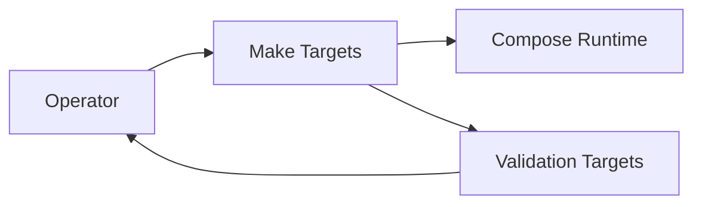
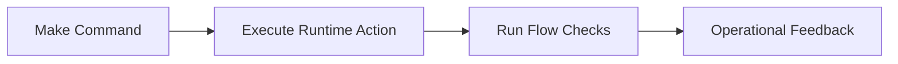

# ADR-0010: Unified Day-2 Operations Interface Through Make Targets

- Status: Accepted
- Date: 2026-04-18

## 1. Summary

Day-2 local operations are standardized on a compact set of Make targets as the primary executable command interface.

## 2. Context

Operational guidance historically drifted between raw docker compose commands, helper scripts, and outdated Make targets.

A narrow, stable command surface is required for repeatability.

## 3. Decision

Use Make targets in [../../Makefile](../../Makefile) as the canonical day-2 command interface for local runtime operations.

Canonical target set:

- make compose-build
- make compose-up
- make compose-down
- make compose-clean
- make mdm-status
- make mdm-topics-check
- make mdm-flow-check

## 4. Operational References

- make compose-up
- make mdm-flow-check
- make compose-down
- make compose-clean

## 5. Validation

Validation is successful when:

- all canonical targets execute successfully in a clean local environment
- command usage in docs remains aligned with current Makefile
- MDM status and topic checks provide expected validation signals

## 6. Consequences

Positive outcomes:

- consistent operator command surface
- easier onboarding and lower ambiguity

Trade-offs:

- Makefile changes must be treated as architecture-impacting changes
- documentation must be updated in lockstep with command-surface updates

## 7. Alternatives Considered

- script-only interface: rejected due to discoverability and drift risk
- runbook-only copy/paste commands with no canonical target layer: rejected due to weak consistency

## 8. References

- [../../Makefile](../../Makefile)
- [../runbook.md](../runbook.md)
- [../architecture.md](../architecture.md)

## 9. Diagrams

### 9.1 Component Diagram

### 9.2 Data Flow Diagram

