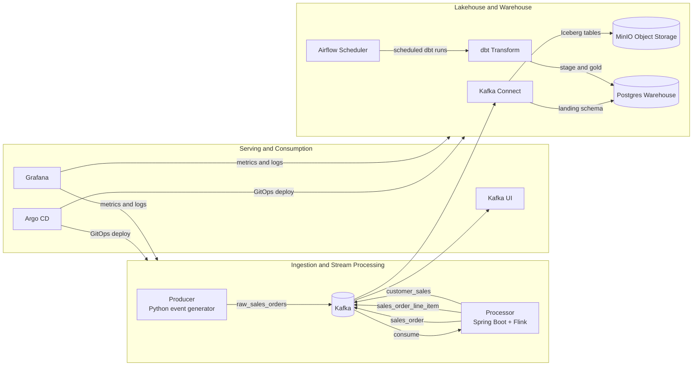
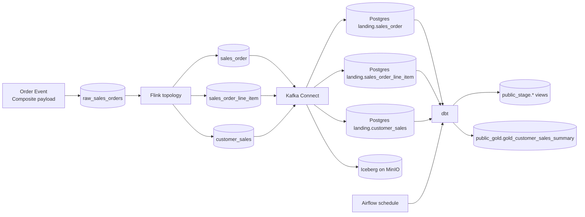

# Architecture Design

This document is the canonical architecture reference for the project and complements the operational guide in `docs/runbook.md`.

## 1. Project-Level Architecture Diagram

## 2. Deployment Component Diagram

```mermaid
flowchart TB
   subgraph LocalCompose[Routine A: Docker Compose]
      direction TB
      C1[producer]
      C2[processor]
      C3[kafka]
      C4[kafka-ui]
      C5[connect]
      C6[connect-init Job]
      C7[minio]
      C8[minio-init Job]
      C9[postgres]
      C10[dbt one-shot Job]
      C11[airflow]
   end

   subgraph KindHelm[Routine B: kind + Helm + Argo CD]
      direction TB
      K1[realtime-app Helm release]
      K2[kafka chart dependency]
      K3[producer Deployment]
      K4[processor Deployment]
      K5[kafka-ui Deployment]
      K6[connect Deployment]
      K7[minio Deployment]
      K8[postgres Deployment]
      K9[airflow Deployment]
      K10[minio-init Job]
      K11[connect-init Job]
      K12[dbt Job]
      K13[prometheus/loki/grafana]
      K14[argocd Application]
   end

   K14 --> K1
   K1 --> K3
   K1 --> K4
   K1 --> K5
   K1 --> K6
   K1 --> K7
   K1 --> K8
   K1 --> K9
   K1 --> K10
   K1 --> K11
   K1 --> K12
   K1 --> K13
   K1 --> K2
```

## 3. End-to-End Dataflow Diagram

## 4. Modern Data Architecture Framework

This implementation follows a modern data platform pattern adapted for local developer productivity and GitOps workflows.

### 4.1 Architectural Layers

- Event ingestion layer:
  Producer publishes immutable domain events to Kafka.
- Stream processing layer:
  Flink performs real-time decomposition and enrichment into analytics-ready topics.
- Lakehouse ingestion layer:
  Kafka Connect persists streams into both object storage (Iceberg on MinIO) and relational landing (Postgres).
- Transformation layer:
  dbt applies SQL-first modeling from landing to stage and gold.
- Orchestration layer:
  Airflow schedules recurring dbt execution.
- Observability and operations layer:
  Kafka UI, Grafana, Loki, Prometheus, and Argo CD provide introspection and control.

### 4.2 Engineering Patterns Used

- Event-carried state transfer:
  Composite order events carry enough context for downstream decomposition.
- Topic fan-out pattern:
  One raw topic fans into domain-focused topics for bounded consumers.
- Dual-sink ingestion pattern:
  Same stream is persisted to both object storage and warehouse landing.
- Medallion-style modeling:
  Landing (bronze-like) -> stage (silver-like) -> gold presentation.
- Idempotent bootstrap jobs:
  Connector registration, MinIO bucket creation, and dbt bootstrap run as one-shot jobs.
- GitOps deployment pattern:
  Argo CD continuously reconciles declarative manifests and Helm values.
- Environment overlay pattern:
  Shared chart + environment-specific values (`dev`, `qa`, `prd`).

### 4.3 Reliability and Operability Principles

- Shift-left validation:
  Helm render/lint and local kind deployment before shared environment promotion.
- Progressive promotion:
  `dev -> qa -> prd` with gates in `docs/runbook.md`.
- Explicit health checkpoints:
  Dedicated health commands for pods, jobs, topic flow, and dbt outputs.
- Reproducible local environments:
  Compose for fast loops and kind+Helm for Kubernetes parity.

### 4.4 Suggested Next Evolution

- Schema governance:
  Introduce Schema Registry and schema compatibility gates.
- Data quality contracts:
  Add dbt tests and freshness checks to deployment gates.
- Incremental gold models:
  Shift heavy gold transformations to incremental materializations.
- Metadata lineage:
  Integrate OpenLineage-compatible tooling from Airflow/dbt.
- Security hardening:
  Move inline credentials to secrets manager and enable TLS/SASL for all environments.
