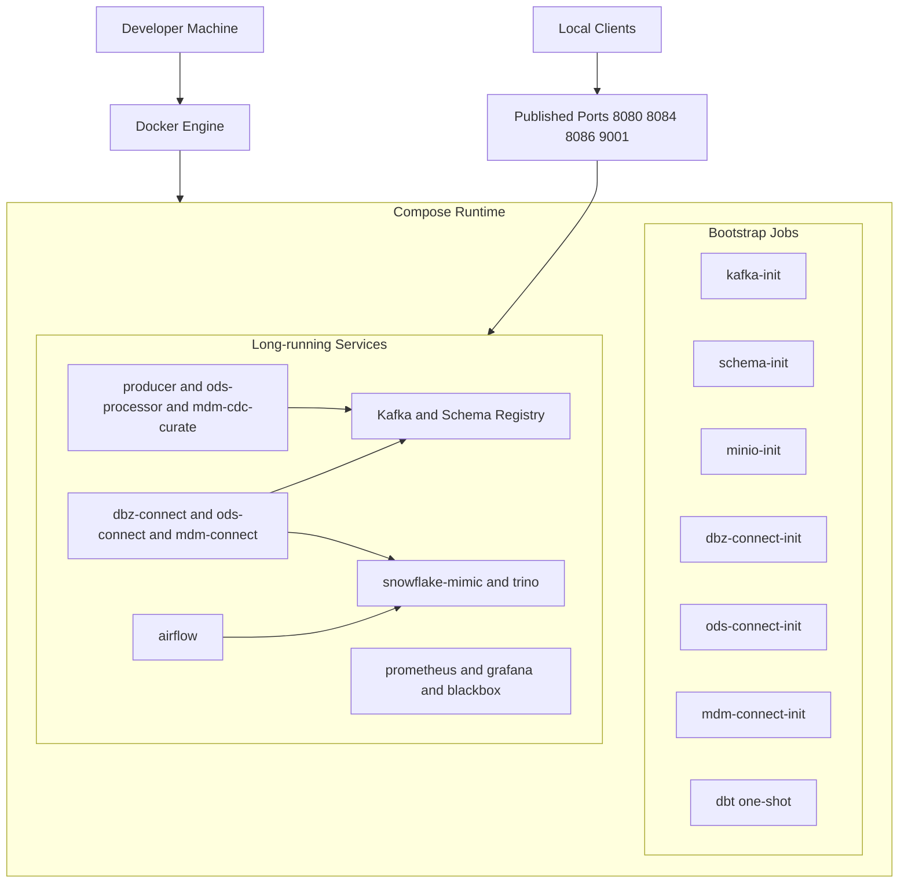
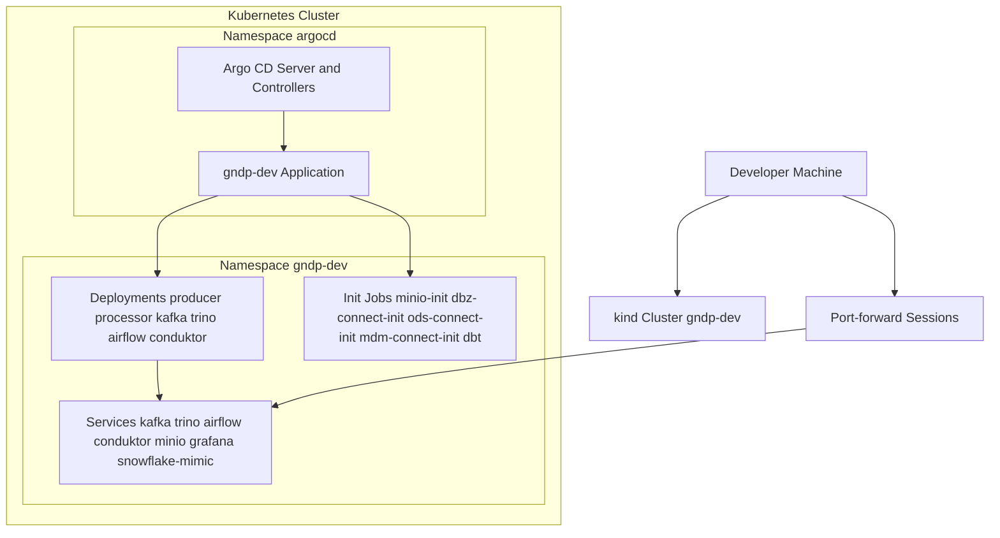

# Deployment Guide

This document is the single reference for bringing up, operating, and tearing down the platform across all three runtime paths.

- **Routine A** — Docker Compose local runtime
- **Routine B** — kind + Helm + Argo CD local GitOps
- **Routine C** — QA/PRD GitOps to cloud Kubernetes (AWS, GCP, Azure)

Cross-references:

- Architecture rationale: [architecture.md](architecture.md)
- Day-2 operator commands: [runbook.md](runbook.md)
- Make target source of truth: [../Makefile](../Makefile)

---

## Table of Contents

1. [Prerequisites](#1-prerequisites)
2. [Routine A: Docker Compose](#2-routine-a-docker-compose)
3. [Routine B: kind + Helm + Argo CD](#3-routine-b-kind--helm--argo-cd)
4. [Routine C: QA/PRD Cloud Kubernetes](#4-routine-c-qaprd-cloud-kubernetes)
5. [Service Comparison: Compose vs Helm](#5-service-comparison-compose-vs-helm)
6. [Endpoints Reference](#6-endpoints-reference)
7. [Common Failure Patterns](#7-common-failure-patterns)
8. [OpenMetadata Deployment](#8-openmetadata-deployment)

---

## 1. Prerequisites

### Routine A

- Docker Desktop running

### Routine B (adds to A)

- `kind` (`brew install kind` or equivalent)
- `kubectl`
- `helm`

### Routine C (adds to B)

- Container images published to a registry reachable by the target cluster
- QA/PRD values maintained in `cicd/k8s/helm/values/values-qa.yaml` and `cicd/k8s/helm/values/values-prd.yaml`
- Argo CD installed and reachable in the control cluster
- kubeconfig with contexts for QA and PRD target clusters

---

## 2. Routine A: Docker Compose

### Start

Bring up the full stack:

```bash
make compose-up
```

Direct Compose path:

```bash
docker compose up -d --build
```

### Validate

Check core status:

```bash
docker compose ps
make mdm-status
```

Validate MDM topic flow end-to-end:

```bash
make mdm-flow-check
```

Manual topic spot checks:

```bash
docker compose exec kafka-3 /usr/bin/kafka-console-consumer --bootstrap-server kafka-3:19094 --topic raw_sales_orders --max-messages 1 --timeout-ms 15000
docker compose exec kafka-3 /usr/bin/kafka-console-consumer --bootstrap-server kafka-3:19094 --topic sales_order --max-messages 1 --timeout-ms 15000
docker compose exec kafka-3 /usr/bin/kafka-console-consumer --bootstrap-server kafka-3:19094 --topic mdm_customer --max-messages 1 --timeout-ms 15000
docker compose exec kafka-3 /usr/bin/kafka-console-consumer --bootstrap-server kafka-3:19094 --topic mdm_product --max-messages 1 --timeout-ms 15000
docker compose exec kafka-3 /usr/bin/kafka-console-consumer --bootstrap-server kafka-3:19094 --topic mdm_date --max-messages 1 --timeout-ms 15000
```

Warehouse layer check:

```bash
docker compose exec -T snowflake-mimic psql -U analytics -d analytics -c \
  "SELECT schemaname, count(*) AS relation_count FROM pg_catalog.pg_tables \
   WHERE schemaname IN ('landing','bronze','silver','gold') GROUP BY schemaname ORDER BY schemaname;"
```

Validate Trino endpoint:

```bash
make trino-smoke
```

### Operate

Run dbt on demand:

```bash
make dbt-run
```

Trigger scheduled dbt DAG manually:

```bash
make airflow-trigger-dbt-dag
```

Tail producer and processor logs:

```bash
docker compose logs --tail=200 --no-color --since=10m producer processor
```

Iceberg smoke test:

```bash
make iceberg-streaming-smoke
```

### Stop and Clean

Stop only:

```bash
make compose-down
```

Stop and remove volumes (full reset, Postgres data will be recreated):

```bash
make compose-clean
```

### Expected Container States

All long-running services should show `Up`. One-shot containers exit cleanly with code 0:

| Container | Expected state |
|---|---|
| `kafka-init` | `Exited (0)` — topics created |
| `schema-init` | `Exited (0)` — Avro subjects registered |
| `minio-init` | `Exited (0)` — bucket created |
| `ods-connect-init` | `Exited (0)` — ODS connectors registered |
| `dbz-connect-init` | `Exited (0)` — Debezium connector registered |
| `mdm-connect-init` | `Exited (0)` — MDM sink connectors registered |
| `dbt` | `Exited (0)` — dbt run completed |

### Deployment Diagram



---

## 3. Routine B: kind + Helm + Argo CD

### Start

#### Preferred bootstrap (one command sequence)

```bash
make k8s-kind-bootstrap
make k8s-build-images
make k8s-argocd-apply
```

Or run the full sequence in one target:

```bash
make k8s-routine-up
```

#### Direct Helm path (bypasses Argo CD)

Use this when validating chart changes locally before committing:

```bash
make helm-deps
make helm-up
```

Before `helm-up`, delete immutable Jobs to avoid upgrade failures:

```bash
kubectl -n gndp-dev delete job \
  gndp-dev-vision-dbz-connect-init \
  gndp-dev-vision-mdm-connect-init \
  gndp-dev-vision-ods-connect-init \
  gndp-dev-vision-dbt \
  gndp-dev-vision-register-schemas-job \
  --ignore-not-found
make helm-up
```

### Validate

App and workload state:

```bash
kubectl -n argocd get application gndp-dev
kubectl -n gndp-dev get pods
kubectl -n gndp-dev get jobs
```

All long-running Deployments should reach `Running`. Expected completed one-shot Jobs:

| Job | Expected state |
|---|---|
| `gndp-dev-vision-minio-init` | `Complete` — bucket created |
| `gndp-dev-vision-ods-connect-init` | `Complete` — ODS connectors registered |
| `gndp-dev-vision-dbz-connect-init` | `Complete` — Debezium connector registered |
| `gndp-dev-vision-mdm-connect-init` | `Complete` — MDM connectors registered |
| `gndp-dev-vision-dbt` | `Complete` — dbt run finished |
| `gndp-dev-vision-register-schemas-job` | `Complete` — Avro schemas registered |

Topic and dataflow validation:

```bash
POD=$(kubectl -n gndp-dev get pod -l app.kubernetes.io/component=kafka -o jsonpath='{.items[0].metadata.name}')
kubectl -n gndp-dev exec "$POD" -- /usr/bin/kafka-topics --bootstrap-server kafka:9092 --list

kubectl -n gndp-dev exec "$POD" -- /usr/bin/kafka-console-consumer \
  --bootstrap-server kafka:9092 --topic raw_sales_orders \
  --partition 0 --offset 0 --max-messages 1 --timeout-ms 15000
```

Repeat for: `sales_order`, `mdm_customer`, `mdm_product`, `mdm_date`.

End-to-end smoke check:

```bash
echo '--- app status ---' && kubectl -n argocd get application gndp-dev && \
echo '--- pods ---' && kubectl -n gndp-dev get pods && \
echo '--- jobs ---' && kubectl -n gndp-dev get jobs && \
echo '--- topics ---' && \
POD=$(kubectl -n gndp-dev get pod -l app.kubernetes.io/component=kafka -o jsonpath='{.items[0].metadata.name}') && \
kubectl -n gndp-dev exec "$POD" -- /usr/bin/kafka-topics --bootstrap-server kafka:9092 --list
```

### Operate

Register connectors manually if init Jobs failed:

```bash
make k8s-register-connectors
```

Re-run dbt Job (delete completed Job and re-apply):

```bash
kubectl -n gndp-dev delete job gndp-dev-vision-dbt --ignore-not-found
kubectl apply -f cicd/argocd/dev.yaml
kubectl -n gndp-dev logs -f job/gndp-dev-vision-dbt
```

Helm chart local validation (no apply):

```bash
make helm-template
```

Reboot dev namespace from local Helm chart:

```bash
make helm-reboot-dev
```

Snapshot dev namespace health:

```bash
make helm-health-dev
```

Ensure Iceberg JDBC metastore tables exist (run once after fresh deploy if `iceberg-writer` crashes):

```bash
make helm-metastore-migrate-dev
```

### Resync and Full Reset

Force refresh Argo CD app object:

```bash
kubectl apply -f cicd/argocd/dev.yaml
```

Full namespace reset:

```bash
kubectl -n argocd delete application gndp-dev
kubectl delete namespace gndp-dev
kubectl apply -f cicd/argocd/dev.yaml
```

### Stop and Clean

Stop cluster workloads (Argo CD path):

```bash
kubectl -n argocd delete application gndp-dev || true
kubectl delete namespace gndp-dev || true
```

Remove Helm release and namespace (direct Helm path):

```bash
make helm-down
```

Remove kind cluster entirely:

```bash
kind delete cluster --name gndp-dev
```

Full teardown in one target:

```bash
make k8s-routine-down
```

### Deployment Diagram



---

## 4. Routine C: QA/PRD Cloud Kubernetes

### Authenticate and fetch cluster credentials

AWS EKS:

```bash
aws eks update-kubeconfig --region <region> --name <qa-cluster-name> --alias qa
aws eks update-kubeconfig --region <region> --name <prd-cluster-name> --alias prd
```

GCP GKE:

```bash
gcloud container clusters get-credentials <qa-cluster-name> --region <region> --project <project-id>
gcloud container clusters get-credentials <prd-cluster-name> --region <region> --project <project-id>
```

Azure AKS:

```bash
az aks get-credentials --resource-group <qa-rg> --name <qa-cluster-name> --context qa --overwrite-existing
az aks get-credentials --resource-group <prd-rg> --name <prd-cluster-name> --context prd --overwrite-existing
```

Verify contexts:

```bash
kubectl config get-contexts
```

### Register external clusters in Argo CD

```bash
argocd cluster add <qa-context>
argocd cluster add <prd-context>
argocd cluster list
```

### Deploy QA

```bash
kubectl apply -f cicd/argocd/qa.yaml
kubectl -n argocd get application realtime-qa
```

Optional force sync:

```bash
argocd app sync realtime-qa
argocd app wait realtime-qa --health --sync --timeout 600
```

### Promote to PRD

After QA validation:

```bash
kubectl apply -f cicd/argocd/prd.yaml
argocd app sync realtime-prd
argocd app wait realtime-prd --health --sync --timeout 900
```

### Rollback

```bash
argocd app rollback realtime-prd
```

Or revert the Git commit and let Argo CD reconcile.

### Release Gate Checklist

- [ ] Gate 1: Change review approved; image tags are immutable
- [ ] Gate 2: QA sync completed — app is Healthy/Synced
- [ ] Gate 3: QA smoke checks passed (pods ready, topic list valid, sample consume succeeds)
- [ ] Gate 4: Production change window and on-call owner confirmed
- [ ] Gate 5: PRD sync completed — app is Healthy/Synced
- [ ] Gate 6: PRD post-deploy checks passed

Rollback triggers:

- [ ] App Degraded or progression blocked longer than agreed timeout
- [ ] Data correctness issue detected in downstream topics
- [ ] SLO/SLA regression detected after PRD sync

### Guardrails

- Promote in order: `dev → qa → prd`
- Keep `prd` with `prune: false` unless explicitly approved
- Use environment-specific immutable image tags; never deploy `latest` to prd
- Always validate Kafka reachability and topic health in target namespaces after each promotion

---

## 5. Service Comparison: Compose vs Helm

"Helm dev" reflects `values-dev.yaml` merged over the base `values.yaml`.

### Core Infrastructure

| Service | Docker Compose | Helm/K8s dev |
|---|---|---|
| Zookeeper | ✅ | ✅ |
| Kafka | ✅ 3-broker cluster (`kafka-1/2/3`) | ✅ single broker (`kafka`) |
| Schema Registry | ✅ | ✅ |
| Schema init | ✅ `schema-init` | ✅ `register-schemas-job` |
| MinIO | ✅ | ✅ |
| MinIO init | ✅ `minio-init` | ✅ init container |
| Postgres (snowflake-mimic) | ✅ | ✅ |

### ODS Pipeline

| Service | Docker Compose | Helm/K8s dev |
|---|---|---|
| ODS source producer | ✅ `ods-source` | ✅ `producer` |
| ODS stream processor | ✅ `ods-processor` | ✅ `processor` |
| ODS Kafka Connect | ✅ `ods-connect` + `ods-connect-init` | ✅ `odsConnect` |

### MDM / CDC Pipeline

| Service | Docker Compose | Helm/K8s dev |
|---|---|---|
| MDM MySQL source | ✅ `mdm-source` | ✅ `mdm.source` |
| Debezium Connect | ✅ `dbz-connect` + `dbz-connect-init` | ✅ `dbzConnect` |
| MDM Connect (JDBC sink) | ✅ `mdm-connect` + `mdm-connect-init` | ✅ part of `mdm` |
| MDM CDC curate | ✅ `mdm-cdc-curate` | ✅ `mdm.cdcCurate` |
| MDM RDS PG writer | ✅ `mdm-rds-pg` | ✅ `mdm.rdsPg` |

### Lakehouse / Analytics

| Service | Docker Compose | Helm/K8s dev |
|---|---|---|
| Trino | ✅ | ✅ |
| Iceberg writer | ✅ | ✅ |
| dbt | ✅ one-shot container | ✅ Kubernetes Job |
| Airflow | ✅ | ✅ |

### Observability

| Service | Docker Compose | Helm/K8s dev |
|---|---|---|
| Prometheus | ✅ | ✅ |
| Grafana | ✅ | ✅ |
| Blackbox exporter | ✅ | ❌ disabled in dev |
| Conduktor (Kafka UI) | ✅ `conduktor` + `conduktor-db` | ✅ |

### Compose-only (no Helm equivalent)

| Service | Notes |
|---|---|
| `kafka-init` | One-shot topic creation; Helm uses an init mechanism inside the Kafka deployment |
| `openmetadata-*` | Present in Compose via `--profile openmetadata`; Helm block exists but `enabled: false` in dev |

### Key Differences

| Area | Docker Compose | Helm/K8s dev |
|---|---|---|
| Kafka topology | 3-broker cluster: `kafka-1:19092`, `kafka-2:19093`, `kafka-3:19094` | Single broker: `kafka:9092` |
| OpenMetadata | Optional `--profile openmetadata` | Present in chart, disabled in dev |
| Blackbox exporter | Always started | Disabled in dev values |
| dbt execution model | Long-running container | Kubernetes Job (exits 0 on completion) |
| Schema history bootstrap (Debezium) | Must use `kafka-1:19092,...` — `kafka:9092` not resolvable | Uses `kafka:9092` via `kafkaBootstrapServers` |

---

## 6. Endpoints Reference

### Routine A (Docker Compose)

| Service | Local URL |
|---|---|
| Kafka broker (external) | `localhost:9094` |
| Conduktor / Kafka UI | `http://localhost:8080` |
| Airflow | `http://localhost:8084` — `admin` / `admin` |
| Trino coordinator | `http://localhost:8086` |
| Debezium Connect REST | `http://localhost:8085` |
| MinIO Console | `http://localhost:9001` — `minio` / `minio123` |
| Prometheus | `http://localhost:9090` |
| Grafana | `http://localhost:3000` |
| MySQL MDM | `localhost:3306` — `root` / `mdmroot` |
| Postgres | `localhost:5432` — `analytics` / `analytics` |

### Routine B (kind + Helm — after port-forward)

| Service | Port-forward command | Local URL |
|---|---|---|
| Argo CD | `kubectl -n argocd port-forward svc/argocd-server 8443:443` | `https://localhost:8443` |
| Conduktor / Kafka UI | `kubectl -n gndp-dev port-forward svc/conduktor 8082:8080` | `http://localhost:8082` |
| Airflow | `kubectl -n gndp-dev port-forward svc/airflow 8084:8080` | `http://localhost:8084` — `admin` / `admin` |
| Trino | `kubectl -n gndp-dev port-forward svc/trino 8086:8080` | `http://localhost:8086` |
| MinIO Console | `kubectl -n gndp-dev port-forward svc/minio 9001:9001` | `http://localhost:9001` — `minio` / `minio123` |
| Grafana | `kubectl -n gndp-dev port-forward svc/grafana 3001:3000` | `http://localhost:3001` |
| Postgres | `kubectl -n gndp-dev port-forward svc/snowflake-mimic 5433:5432` | `localhost:5433` — `analytics` / `analytics` |
| MySQL MDM | `kubectl -n gndp-dev port-forward svc/mdm-source 3307:3306` | `localhost:3307` — `root` / `mdmroot` |

Port-forward all UIs at once (Routine B):

```bash
make k8s-ui-port-forward
```

---

## 7. Common Failure Patterns

### Routine A

| Symptom | Resolution |
|---|---|
| No `bronze` rows with `landing` rows present | Run `make dbt-run`, then recheck bronze counts |
| `dbt` shows `Exited (0)` | Expected — one-shot container completed successfully |
| Landing rows stay at zero, Kafka Connect healthy | Check `docker compose logs --tail=200 ods-connect`; confirm `ods-connect-init` completed |
| MDM landing tables empty, MySQL has rows | Check `docker compose logs --tail=200 mdm-cdc-curate`; verify Postgres connectivity |
| Debezium not producing raw CDC topics | Check `docker compose logs --tail=200 dbz-connect`; ensure `dbz-connect-init` completed |
| Airflow webserver fails with stale PID file | `docker compose exec airflow rm -f /opt/airflow/airflow-webserver.pid && docker compose restart airflow` |
| Trino connection reset right after restart | Wait for Trino healthcheck to pass, then rerun `make trino-smoke` |
| `trino-sync-lakehouse` fails with duplicate MERGE keys | Query duplicates: `SELECT orderid, count(*) FROM warehouse.landing.sales_order GROUP BY orderid HAVING count(*) > 1` |
| Debezium `KafkaException: No resolvable bootstrap urls` | Schema history bootstrap servers must use `kafka-1:19092,...` not `kafka:9092` in Compose |

### Routine B

| Symptom | Resolution |
|---|---|
| Pods show `ErrImageNeverPull` | Rerun `./cicd/scripts/build-images.sh` to load images into kind node |
| `iceberg-writer` in `CrashLoopBackOff` | Run `make helm-metastore-migrate-dev` to create Iceberg metastore tables |
| Argo CD shows `ComparisonError` / `SYNC STATUS: Unknown` | Add repository credentials to Argo CD for the configured source repo |
| `helm upgrade` fails on immutable Job spec | Delete init Jobs with `kubectl -n gndp-dev delete job ...`, then rerun `make helm-up` |
| Helm ConfigMap-mounted DAGs/configs not reloaded | Restart affected Deployments after `helm upgrade` |
| Argo CD app missing from UI | `kubectl apply -f cicd/argocd/dev.yaml` |
| Port-forward exits immediately | Kill stale listeners: `lsof -ti tcp:<port> \| xargs -r kill`, then retry |

---

## 8. OpenMetadata Deployment

This section covers deploying OpenMetadata alongside Routine A (Docker Compose) to provide unified metadata, lineage, and data discovery across Trino, Postgres, dbt, Airflow, and Kafka.

Out of scope: production hardening (SSO, TLS, HA, backup policy) and Kubernetes deployment manifests.

### Stack Mapping

| Service | Internal address |
|---|---|
| Trino | `trino:8080` (host port `8086`) |
| Postgres warehouse | `snowflake-mimic:5432` |
| Kafka | `kafka:9092` |
| Schema Registry | `schema-registry:8081` |
| Airflow | `airflow:8080` (host port `8084`) |
| dbt | `analytics/dbt` (project path) |

### Hardening Notes (applied 2026-04-20)

- Postgres runs with `shared_preload_libraries=pg_stat_statements` and `pg_stat_statements.track=all`; metadata ingestion runs `CREATE EXTENSION IF NOT EXISTS pg_stat_statements` before Postgres ingestion.
- Kafka ingestion uses `schemaRegistryURL: http://schema-registry:8081` to satisfy `CheckSchemaRegistry` and remove schema-registry warning noise.

### Compose Service Blueprint

Add the following to `docker-compose.yml`:

```yaml
  openmetadata-db:
    image: mysql:8.4
    environment:
      MYSQL_ROOT_PASSWORD: openmetadata_root
      MYSQL_DATABASE: openmetadata_db
      MYSQL_USER: openmetadata_user
      MYSQL_PASSWORD: openmetadata_pass
    ports:
      - "3307:3306"
    volumes:
      - openmetadata-db-data:/var/lib/mysql

  openmetadata-search:
    image: docker.elastic.co/elasticsearch/elasticsearch:8.14.3
    environment:
      - discovery.type=single-node
      - xpack.security.enabled=false
      - ES_JAVA_OPTS=-Xms1g -Xmx1g
    ports:
      - "9200:9200"
    volumes:
      - openmetadata-es-data:/usr/share/elasticsearch/data

  openmetadata-server:
    image: openmetadata/server:1.5.8
    depends_on:
      - openmetadata-db
      - openmetadata-search
    environment:
      OPENMETADATA_CLUSTER_NAME: local
      SERVER_HOST_API_URL: http://openmetadata-server:8585/api
      DB_DRIVER_CLASS: com.mysql.cj.jdbc.Driver
      DB_SCHEME: mysql
      DB_USE_SSL: "false"
      DB_HOST: openmetadata-db
      DB_PORT: "3306"
      OM_DATABASE: openmetadata_db
      DB_USER: openmetadata_user
      DB_USER_PASSWORD: openmetadata_pass
      ELASTICSEARCH_HOST: openmetadata-search
      ELASTICSEARCH_PORT: "9200"
      ELASTICSEARCH_SCHEME: http
    ports:
      - "8585:8585"

  openmetadata-ingestion:
    image: openmetadata/ingestion:1.5.8
    depends_on:
      - openmetadata-server
    entrypoint: ["/bin/bash", "-lc", "sleep infinity"]
    volumes:
      - ./platform-services/metadata/openmetadata:/opt/openmetadata/metadata
```

Add volumes:

```yaml
volumes:
  openmetadata-db-data:
  openmetadata-es-data:
```

### Connector Workflow Files

Store workflow YAMLs under `platform-services/metadata/openmetadata/workflows/`.

**Trino** (`trino_ingestion.yaml`)

```yaml
source:
  type: trino
  serviceName: trino-lakehouse
  serviceConnection:
    config:
      type: Trino
      hostPort: trino:8080
      username: analytics
      catalog: lakehouse
  sourceConfig:
    config:
      type: DatabaseMetadata
      includeTables: true
      includeViews: true
      schemaFilterPattern:
        includes:
          - streaming
          - demo
sink:
  type: metadata-rest
  config:
    api_endpoint: http://openmetadata-server:8585/api
workflowConfig:
  openMetadataServerConfig:
    hostPort: http://openmetadata-server:8585/api
    authProvider: openmetadata
    securityConfig:
      jwtToken: <OPENMETADATA_JWT_TOKEN>
```

**Postgres** (`postgres_ingestion.yaml`)

```yaml
source:
  type: postgres
  serviceName: postgres-warehouse
  serviceConnection:
    config:
      type: Postgres
      hostPort: snowflake-mimic:5432
      username: analytics
      authType:
        password: analytics
      database: analytics
  sourceConfig:
    config:
      type: DatabaseMetadata
      includeTables: true
      schemaFilterPattern:
        includes:
          - landing
          - bronze
          - silver
          - gold
sink:
  type: metadata-rest
  config:
    api_endpoint: http://openmetadata-server:8585/api
workflowConfig:
  openMetadataServerConfig:
    hostPort: http://openmetadata-server:8585/api
    authProvider: openmetadata
    securityConfig:
      jwtToken: <OPENMETADATA_JWT_TOKEN>
```

**dbt** (`dbt_ingestion.yaml`)

```yaml
source:
  type: dbt
  serviceName: trino-lakehouse
  sourceConfig:
    config:
      type: DBT
      dbtConfigSource:
        dbtConfigType: local
        dbtManifestFilePath: /opt/openmetadata/metadata/analytics/dbt/target/openmetadata/manifest.json
        dbtRunResultsFilePath: /opt/openmetadata/metadata/analytics/dbt/target/openmetadata/run_results.json
      dbtUpdateDescriptions: true
      includeTags: true
sink:
  type: metadata-rest
  config:
    api_endpoint: http://openmetadata-server:8585/api
workflowConfig:
  openMetadataServerConfig:
    hostPort: http://openmetadata-server:8585/api
    authProvider: openmetadata
    securityConfig:
      jwtToken: <OPENMETADATA_JWT_TOKEN>
```

**Airflow** (`airflow_ingestion.yaml`)

```yaml
source:
  type: airflow
  serviceName: airflow-orchestration
  serviceConnection:
    config:
      type: Airflow
      hostPort: http://airflow:8080
      connection:
        type: SQLite
        databaseMode: /opt/airflow/airflow.db
  sourceConfig:
    config:
      type: PipelineMetadata
      includeLineage: true
sink:
  type: metadata-rest
  config:
    api_endpoint: http://openmetadata-server:8585/api
workflowConfig:
  openMetadataServerConfig:
    hostPort: http://openmetadata-server:8585/api
    authProvider: openmetadata
    securityConfig:
      jwtToken: <OPENMETADATA_JWT_TOKEN>
```

**Kafka** (`kafka_ingestion.yaml`)

```yaml
source:
  type: kafka
  serviceName: kafka-streaming
  serviceConnection:
    config:
      type: Kafka
      bootstrapServers: kafka:9092
      schemaRegistryURL: http://schema-registry:8081
  sourceConfig:
    config:
      type: MessagingMetadata
      topicFilterPattern:
        includes:
          - raw_sales_orders
          - sales_order
          - sales_order_line_item
          - customer_sales
          - mdm_customer
          - mdm_product
          - mdm_date
sink:
  type: metadata-rest
  config:
    api_endpoint: http://openmetadata-server:8585/api
workflowConfig:
  openMetadataServerConfig:
    hostPort: http://openmetadata-server:8585/api
    authProvider: openmetadata
    securityConfig:
      jwtToken: <OPENMETADATA_JWT_TOKEN>
```

### Phased Rollout

| Phase | Action | Gate |
|---|---|---|
| 0 — Prerequisites | `make mdm-flow-check` + `make trino-smoke` + `make dbt-run` + `make openmetadata-prepare-dbt-artifacts` | Routine A healthy, Trino working |
| 1 — Platform bring-up | `docker compose up -d openmetadata-db openmetadata-search openmetadata-server openmetadata-ingestion` | UI reachable at `http://localhost:8585`, search backend healthy |
| 2 — Foundational metadata | Run Trino + Postgres ingestion | `lakehouse` and `warehouse` entities visible |
| 3 — Lineage enrichment | Run dbt + Airflow ingestion | Lineage visible landing→bronze/silver/gold; Airflow DAG `dbt_warehouse_schedule` visible |
| 4 — Streaming metadata | Run Kafka ingestion | Core streaming topics discoverable |
| 5 — Operationalize | Schedule hourly metadata + daily lineage refresh; define owners and tags | Ingestion schedules stable for one week; no repeated connector failures |

### Execution Commands

Make targets (preferred):

```bash
make openmetadata-up
make openmetadata-status
make openmetadata-ingest-trino
make openmetadata-ingest-postgres
make openmetadata-ingest-dbt
make openmetadata-ingest-airflow
make openmetadata-ingest-kafka
```

Stack health checks:

```bash
docker compose ps snowflake-mimic schema-registry openmetadata-server openmetadata-ingestion
curl -fsS http://localhost:8585 >/dev/null && echo "openmetadata: healthy"
```

Run workflows manually inside the ingestion container:

```bash
metadata ingest -c /opt/openmetadata/metadata/workflows/trino_ingestion.yaml
metadata ingest -c /opt/openmetadata/metadata/workflows/postgres_ingestion.yaml
metadata ingest -c /opt/openmetadata/metadata/workflows/dbt_ingestion.yaml
metadata ingest -c /opt/openmetadata/metadata/workflows/airflow_ingestion.yaml
metadata ingest -c /opt/openmetadata/metadata/workflows/kafka_ingestion.yaml
```

### Risks and Mitigations

| Risk | Mitigation |
|---|---|
| Connector drift from local auth/network changes | Keep workflow YAMLs in Git; validate with `docker compose config` |
| Weak lineage from naming inconsistency | Enforce naming conventions across Trino catalogs, dbt models, and Airflow tasks |
| dbt artifact path mismatch in ingestion container | Mount `analytics/dbt` into ingestion container read-only; validate before run |

### Success Criteria

- One UI for searchable metadata across lakehouse, warehouse, pipelines, and topics
- Working lineage from source ingestion to transformed analytics layers
- Repeatable connector workflows under source control
- Clear ownership and tags on critical datasets and topics
