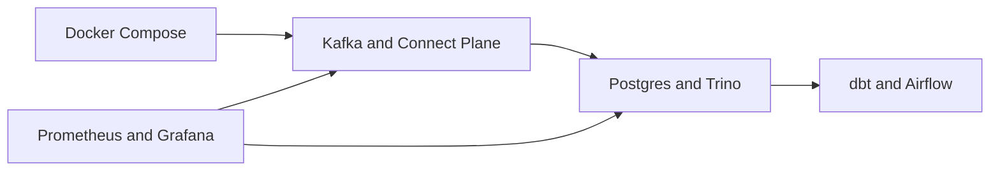
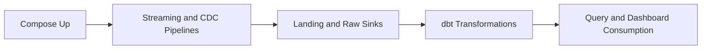

## Routine A: Docker Compose Local Runtime

Routine A is the primary local workflow for this repository.
It uses Docker Compose as the runtime and Make targets for repeatable operations.

## Start

Bring up the full stack:

```bash
make compose-up
```

Direct compose path:

```bash
docker compose up -d --build
```

## Validate

Check core status:

```bash
docker compose ps
make mdm-status
```

Validate MDM topic flow end-to-end:

```bash
make mdm-flow-check
```

Manual topic spot checks:

```bash
docker compose exec kafka-3 /usr/bin/kafka-console-consumer --bootstrap-server kafka-3:19094 --topic raw_sales_orders --max-messages 1 --timeout-ms 15000
docker compose exec kafka-3 /usr/bin/kafka-console-consumer --bootstrap-server kafka-3:19094 --topic sales_order --max-messages 1 --timeout-ms 15000
docker compose exec kafka-3 /usr/bin/kafka-console-consumer --bootstrap-server kafka-3:19094 --topic sales_order_line_item --max-messages 1 --timeout-ms 15000
docker compose exec kafka-3 /usr/bin/kafka-console-consumer --bootstrap-server kafka-3:19094 --topic customer_sales --max-messages 1 --timeout-ms 15000
```

Check landing row counts in Postgres (`snowflake-mimic`):

```bash
docker compose exec -T snowflake-mimic psql -U analytics -d analytics -c "SELECT count(*) AS landing_sales_order FROM landing.sales_order; SELECT count(*) AS landing_sales_order_line_item FROM landing.sales_order_line_item; SELECT count(*) AS landing_customer_sales FROM landing.customer_sales;"
```

Validate Trino endpoint:

```bash
curl -fsS http://localhost:8086/v1/info | cat
```

## Operate

Run dbt on demand:

```bash
docker compose run --rm dbt
```

Start Airflow:

```bash
docker compose up -d --build airflow
```

Tail producer and processor logs:

```bash
docker compose logs --tail=200 --no-color --since=10m producer processor
```

## Stop and Clean

Stop stack:

```bash
make compose-down
```

Deep clean Docker resources:

```bash
make compose-clean
```

## Notes

- One-shot containers may show `Exited (0)` after successful initialization.
- Main one-shot services include `kafka-init`, `schema-init`, `minio-init`, `dbz-connect-init`, `ods-connect-init`, `mdm-connect-init`, and `dbt`.
- Debezium CDC source runs on `dbz-connect`; `mdm-connect` is used for MDM sink connectors.

## Component Diagram



## Data Flow Diagram


