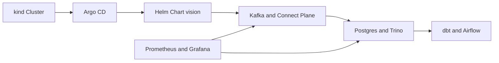
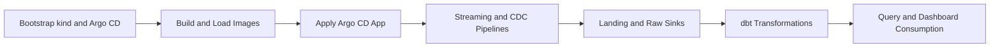

## Routine B: kind + Helm + Argo CD

Routine B is the GitOps local workflow for this repository.
It uses a kind cluster, Helm chart (`vision`), and Argo CD for declarative deployment simulation.

## Prerequisites

- Docker Desktop running
- `kind` installed (`brew install kind` or equivalent)
- `kubectl` installed
- `helm` installed
- Repository root as working directory

## Start

### Preferred bootstrap (one command sequence)

Bootstrap kind cluster and Argo CD, build images, and deploy via Argo CD:

```bash
./cicd/k8s/kind/bootstrap-kind.sh
./cicd/scripts/build-images.sh
kubectl apply -f cicd/argocd/dev.yaml
```

Make-target equivalent:

```bash
make k8s-kind-bootstrap
make k8s-build-images
make k8s-argocd-apply
```

Or run the full Routine B sequence in one Make target:

```bash
make k8s-routine-up
```

### Manual bootstrap (step-by-step)

Use this when you want to run each phase independently or when debugging bootstrap failures.

1. Bootstrap kind cluster and install Argo CD control plane:

   ```bash
   CLUSTER_NAME=gndp-dev ./cicd/k8s/kind/bootstrap-kind.sh
   kubectl -n argocd get pods
   ```

2. Build and load local images into the kind node:

   ```bash
   ./cicd/scripts/build-images.sh
   ```

3. Apply Argo CD application manifest:

   ```bash
   kubectl apply -f cicd/argocd/dev.yaml
   ```

4. Verify Argo CD registered the app:

   ```bash
   kubectl -n argocd get application gndp-dev
   ```

### Direct Helm path (without Argo CD reconciliation)

Use direct Helm when bypassing Argo CD sync or validating chart changes locally before committing:

```bash
make helm-deps
make helm-up
```

## Validate

### App and workload state

```bash
kubectl -n argocd get application gndp-dev
kubectl -n gndp-dev get pods
kubectl -n gndp-dev get jobs
```

All long-running Deployments should reach `Running`. Expected completed one-shot Jobs:

- `gndp-dev-vision-minio-init` — exits with code 0 after MinIO bucket creation
- `gndp-dev-vision-ods-connect-init` — exits with code 0 after ODS connector registration
- `gndp-dev-vision-dbz-connect-init` — exits with code 0 after Debezium connector registration
- `gndp-dev-vision-mdm-connect-init` — exits with code 0 after MDM connector registration
- `gndp-dev-vision-dbt` — exits with code 0 after `dbt run` completes
- `gndp-dev-vision-register-schemas-job` — exits with code 0 after Avro schema registration

`Completed` state for these Jobs is expected and should not be treated as failure.

### Topic and dataflow validation

List topics in cluster:

```bash
POD=$(kubectl -n gndp-dev get pod -l app.kubernetes.io/component=kafka -o jsonpath='{.items[0].metadata.name}')
kubectl -n gndp-dev exec "$POD" -- /usr/bin/kafka-topics --bootstrap-server kafka:9092 --list
```

Consume sample messages from key topics:

```bash
POD=$(kubectl -n gndp-dev get pod -l app.kubernetes.io/component=kafka -o jsonpath='{.items[0].metadata.name}')
kubectl -n gndp-dev exec "$POD" -- /usr/bin/kafka-console-consumer \
  --bootstrap-server kafka:9092 \
  --topic raw_sales_orders --partition 0 --offset 0 --max-messages 1 --timeout-ms 15000

kubectl -n gndp-dev exec "$POD" -- /usr/bin/kafka-console-consumer \
  --bootstrap-server kafka:9092 \
  --topic sales_order --partition 0 --offset 0 --max-messages 1 --timeout-ms 15000

kubectl -n gndp-dev exec "$POD" -- /usr/bin/kafka-console-consumer \
  --bootstrap-server kafka:9092 \
  --topic mdm_customer --partition 0 --offset 0 --max-messages 1 --timeout-ms 15000

kubectl -n gndp-dev exec "$POD" -- /usr/bin/kafka-console-consumer \
  --bootstrap-server kafka:9092 \
  --topic mdm_product --partition 0 --offset 0 --max-messages 1 --timeout-ms 15000
```

### MDM CDC flow validation

```bash
kubectl -n gndp-dev logs deploy/gndp-dev-vision-mdm-cdc-curate --tail=100
```

### Iceberg writer validation

```bash
kubectl -n gndp-dev logs deploy/gndp-dev-vision-iceberg-writer --tail=100
```

### dbt and Airflow validation

```bash
kubectl -n gndp-dev logs job/gndp-dev-vision-dbt --tail=100
kubectl -n gndp-dev logs deploy/gndp-dev-vision-airflow --tail=100
```

### Trino endpoint validation

Port-forward Trino then check health:

```bash
kubectl -n gndp-dev port-forward svc/trino 8086:8080 &
make trino-smoke
```

### End-to-end smoke check

```bash
echo '--- app status ---' && \
kubectl -n argocd get application gndp-dev && \
echo '--- pods ---' && \
kubectl -n gndp-dev get pods && \
echo '--- jobs ---' && \
kubectl -n gndp-dev get jobs && \
echo '--- topics ---' && \
POD=$(kubectl -n gndp-dev get pod -l app.kubernetes.io/component=kafka -o jsonpath='{.items[0].metadata.name}') && \
kubectl -n gndp-dev exec "$POD" -- /usr/bin/kafka-topics --bootstrap-server kafka:9092 --list
```

## Operate

### Access web UIs

Port-forward services to access UIs locally. Each command runs in the foreground; use separate terminals or background with `&`.

Argo CD:

```bash
kubectl -n argocd port-forward svc/argocd-server 8443:443
```

- URL: `https://localhost:8443`
- Username: `admin`
- Password: `kubectl -n argocd get secret argocd-initial-admin-secret -o jsonpath='{.data.password}' | base64 --decode; echo`

Kafka UI:

```bash
kubectl -n gndp-dev port-forward svc/conduktor 8082:8080
```

- URL: `http://localhost:8082`

Airflow:

```bash
kubectl -n gndp-dev port-forward svc/airflow 8084:8080
```

- URL: `http://localhost:8084`
- Username: `admin` / Password: `admin`

MinIO Console:

```bash
kubectl -n gndp-dev port-forward svc/minio 9001:9001
```

- URL: `http://localhost:9001`
- Username: `minio` / Password: `minio123`

Trino:

```bash
kubectl -n gndp-dev port-forward svc/trino 8086:8080
```

- URL: `http://localhost:8086`

Grafana:

```bash
kubectl -n gndp-dev port-forward svc/grafana 3001:3000
```

- URL: `http://localhost:3001`

Postgres (for DBeaver or psql):

```bash
kubectl -n gndp-dev port-forward svc/snowflake-mimic 5433:5432
```

- Host: `127.0.0.1`, Port: `5433`, Username: `analytics`, Password: `analytics`, DB: `analytics`

MySQL MDM:

```bash
kubectl -n gndp-dev port-forward svc/mdm-source 3307:3306
```

- Host: `127.0.0.1`, Port: `3307`, Username: `root`, Password: `mdmroot`, DB: `mdm`

### Connect DBeaver to Trino (Routine B)

After port-forwarding Trino on `8086`:

1. Open DBeaver and select New Database Connection.
2. Search for and select `Trino`.
3. Set connection parameters:
   - Host: `localhost`
   - Port: `8086`
   - Catalog: `lakehouse`
   - Schema: `streaming` (optional default)
   - Username: `analytics`
   - Password: leave empty
4. Click Test Connection, then Finish.

### Register connectors manually

If one-shot init Jobs fail or connectors need to be re-registered:

```bash
make k8s-register-dbz
make k8s-register-mdm
make k8s-register-ods
```

Or all at once:

```bash
make k8s-register-connectors
```

### Trigger dbt run in cluster

Run the dbt Job manually by deleting the completed Job and reapplying the Argo CD app:

```bash
kubectl -n gndp-dev delete job gndp-dev-vision-dbt --ignore-not-found
kubectl apply -f cicd/argocd/dev.yaml
kubectl -n gndp-dev logs -f job/gndp-dev-vision-dbt
```

### Helm chart validation (local, pre-commit)

Render templates without applying:

```bash
make helm-template
```

Upgrade in place (skips Argo CD, applies directly):

```bash
make helm-up
```

Before `helm-up`, immutable Jobs must be deleted:

```bash
kubectl -n gndp-dev delete job \
  gndp-dev-vision-dbz-connect-init \
  gndp-dev-vision-mdm-connect-init \
  gndp-dev-vision-ods-connect-init \
  gndp-dev-vision-dbt \
  gndp-dev-vision-register-schemas-job \
  --ignore-not-found
make helm-up
```

### Resync and full reset

Force refresh Argo CD app object:

```bash
kubectl apply -f cicd/argocd/dev.yaml
```

Delete and recreate app only:

```bash
kubectl -n argocd delete application gndp-dev
kubectl apply -f cicd/argocd/dev.yaml
```

Full namespace reset:

```bash
kubectl -n argocd delete application gndp-dev
kubectl delete namespace gndp-dev
kubectl apply -f cicd/argocd/dev.yaml
```

## Stop and Clean

Stop cluster workloads (Argo CD path):

```bash
kubectl -n argocd delete application gndp-dev || true
kubectl delete namespace gndp-dev || true
```

Remove Helm release and namespace (direct Helm path):

```bash
make helm-down
```

Remove the kind cluster entirely:

```bash
kind delete cluster --name gndp-dev
```

## Notes

- Image prerequisite: all custom service images must be loaded into the kind node before Argo CD or Helm can schedule them. If pods show `ErrImageNeverPull`, rerun `./cicd/scripts/build-images.sh`.
- Argo CD syncs from the configured Git repo/branch. Local uncommitted chart edits are not reflected by Argo CD sync. Validate locally with `make helm-up` before committing.
- If Argo CD shows `ComparisonError` and `SYNC STATUS: Unknown`, add repository credentials to Argo CD for the configured source repo.
- If `iceberg-writer` enters `CrashLoopBackOff` after a fresh deploy, the Postgres Iceberg metastore tables may not yet exist. Delete immutable Jobs, rerun `make helm-up` (which triggers init Jobs), and wait for metastore creation before restarting `iceberg-writer`.
- Helm upgrades will fail on immutable Job specs. Always delete init/bootstrap Jobs before running `helm upgrade`.
- Helm ConfigMap-mounted files (Airflow DAGs, Trino catalog properties) do not hot-reload after `helm upgrade`. Restart the affected Deployments to pick up changes.
- One-shot init containers that exit with code 0 are healthy completions, not failures.

## Component Diagram



## Data Flow Diagram


