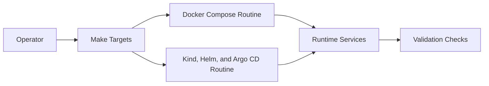
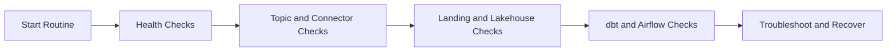
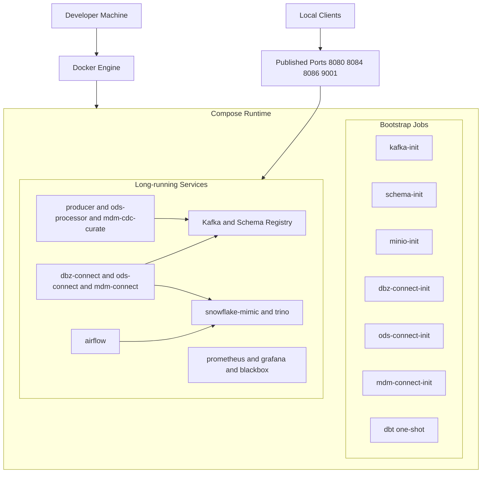
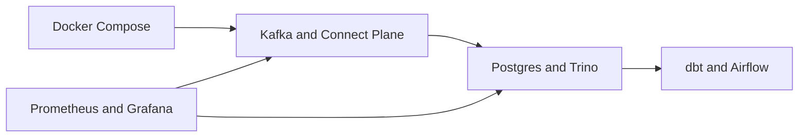
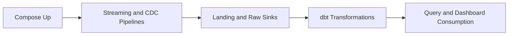
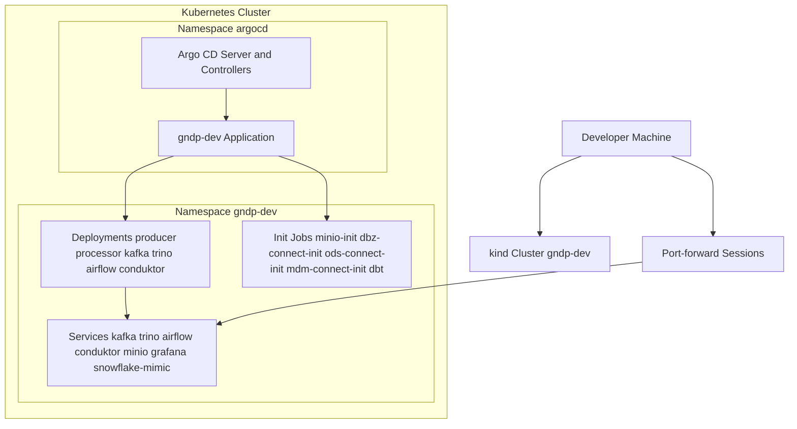
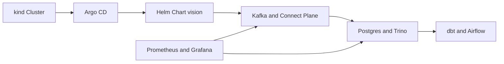
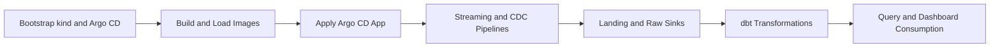

# Local Development Operations Runbook

This runbook defines three supported local operation routines:

- Routine A: Docker Compose (fast local loop)
- Routine B: kind + Helm + Argo CD (GitOps local cluster loop)
- Routine K8S: Isolated kind + Helm (no image build, no Argo CD)

Use only one routine at a time for a clean workflow.

## Purpose

Provide repeatable day-2 operational procedures for both local runtime routines.

## Commands

Use the Operator Cheat Sheet and routine sections for copy-paste command bundles.

## Validation

Use the validation checkpoints in Routine A and Routine B to verify service health, dataflow, and analytics outputs.

## Troubleshooting

Use the troubleshooting sections in this document as the primary operational diagnostic path.

## References

- [../readme.md](../readme.md)
- [architecture.md](architecture.md)
- [adr/README.md](adr/README.md)

## Component Diagram



## Data Flow Diagram



Architecture cross-reference:

- For a concise architecture-to-command mapping, see [Make Target Map (Architecture to Operations)](architecture.md#84-make-target-map-architecture-to-operations).

Documentation map:

- Project entrypoint: [../readme.md](../readme.md)
- Architecture reference: [architecture.md](architecture.md)
- Architecture Decision Records (ADR): [adr/README.md](adr/README.md)

## Credential Quick Sheet

| Component | Routine A (Docker Compose) | Routine B (kind + Helm) | Username | Password / Retrieval |
| --- | --- | --- | --- | --- |
| Argo CD UI | N/A | `https://localhost:8443` (after `kubectl -n argocd port-forward svc/argocd-server 8443:443`) | admin | `kubectl -n argocd get secret argocd-initial-admin-secret -o jsonpath='{.data.password}' \| base64 --decode; echo` |
| MinIO Console | `http://localhost:9001` | `http://localhost:9001` (after `kubectl -n gndp-dev port-forward svc/minio 9001:9001`) | minio | minio123 |
| Postgres | 127.0.0.1:5432 / db `analytics` | 127.0.0.1:5433 / db `analytics` (after `kubectl -n gndp-dev port-forward svc/snowflake-mimic 5433:5432`) | analytics | analytics |
| MySQL MDM | 127.0.0.1:3306 / db `mdm` | 127.0.0.1:3307 / db `mdm` (after `kubectl -n gndp-dev port-forward svc/mdm-source 3307:3306`) | root | mdmroot |
| Airflow UI | `http://localhost:8084` | `http://localhost:8084` (after `kubectl -n gndp-dev port-forward svc/airflow 8084:8080`) | admin | admin |

## Operator Cheat Sheet

| Routine | Daily task | Copy-paste command bundle |
| --- | --- | --- |
| Docker Compose | Bootstrap local routine (stack + topics) | `make compose-up` |
| Docker Compose | Start compose services only | `docker compose up -d` |
| Docker Compose | Run MDM flow validation | `make mdm-flow-check` |
| Docker Compose | Fast health check | `docker compose ps` |
| Docker Compose | Tail app logs | `docker compose logs --tail=200 --no-color --since=10m producer processor` |
| Docker Compose | Rebuild processor only + validate | `docker compose up -d --build processor && docker compose logs --tail=120 --no-color --since=2m processor` |
| Docker Compose | Validate MDM topic flow | `make mdm-topics-check` |
| Docker Compose | Verify Trino endpoint | `make trino-smoke` |
| Docker Compose | Start Airflow service | `docker compose up -d --build airflow` |
| Docker Compose | Run dbt once | `make dbt-run` |
| Docker Compose | Full clean reset | `docker compose down -v && docker compose up -d --build` |
| kind + Helm + Argo CD | Bootstrap local cluster | `./cicd/k8s/kind/bootstrap-kind.sh` |
| kind + Helm + Argo CD | Build and load local images into kind | `./cicd/scripts/build-images.sh` |
| kind + Helm + Argo CD | Bootstrap local cluster via Argo CD app | `kubectl apply -f cicd/argocd/dev.yaml` |
| kind + Helm + Argo CD | Stop local cluster workloads | `kubectl -n argocd delete application gndp-dev || true && kubectl delete namespace gndp-dev || true` |
| kind + Helm + Argo CD | Validate app and workloads | `kubectl -n argocd get application gndp-dev && kubectl -n gndp-dev get pods` |
| kind + Helm + Argo CD | Runtime status snapshot | `kubectl -n gndp-dev get pods && kubectl -n gndp-dev get jobs` |
| kind + Helm + Argo CD | Validate MDM topic flow | `kubectl -n gndp-dev logs deploy/gndp-dev-vision-mdm-cdc-curate --tail=100` |
| kind + Helm + Argo CD | Validate Airflow + dbt state | `kubectl -n gndp-dev get pods | grep -E 'airflow|dbt'` |
| kind + Helm + Argo CD | Open Argo CD UI | `kubectl -n argocd port-forward svc/argocd-server 8443:443` |
| kind + Helm + Argo CD | Open Kafka UI | `kubectl -n gndp-dev port-forward svc/conduktor 8082:8080` |
| kind + Helm + Argo CD | Open Airflow UI | `kubectl -n gndp-dev port-forward svc/airflow 8084:8080` |
| kind + Helm + Argo CD | Open MinIO Console | `kubectl -n gndp-dev port-forward svc/minio 9001:9001` |
| kind + Helm + Argo CD | Check Trino health | `kubectl -n gndp-dev port-forward svc/trino 8086:8080` |
| kind + Helm + Argo CD | Validate streaming Iceberg tables received data | `kubectl -n gndp-dev logs deploy/gndp-dev-vision-iceberg-writer --tail=100` |
| kind + Helm + Argo CD | Open Postgres | `kubectl -n gndp-dev port-forward svc/snowflake-mimic 5433:5432` |
| kind + Helm + Argo CD | Open Grafana | `kubectl -n gndp-dev port-forward svc/grafana 3001:3000` |
| kind + Helm + Argo CD | Cluster smoke check | `echo '--- app ---' && kubectl -n argocd get application gndp-dev && echo '--- pods ---' && kubectl -n gndp-dev get pods && echo '--- topics ---' && POD=$(kubectl -n gndp-dev get pod -l app.kubernetes.io/component=kafka -o jsonpath='{.items[0].metadata.name}') && kubectl -n gndp-dev exec "$POD" -- /usr/bin/kafka-topics --bootstrap-server kafka:9092 --list` |
| kind + Helm + Argo CD | Recreate app + namespace | `kubectl -n argocd delete application gndp-dev && kubectl delete namespace gndp-dev && kubectl apply -f cicd/argocd/dev.yaml` |

## Scope and Goals

- Bring up the full realtime pipeline end-to-end.
- Validate topic fan-out from raw input to derived topics.
- Provide repeatable start, validate, troubleshoot, and reset steps.

## Prerequisites

- Docker Desktop running
- kubectl installed
- kind installed for Routine B
- Access to this repository root directory

## Routine A: Docker Compose

### A1. Start stack

Architecture-to-command map:

- See [Make Target Map (Architecture to Operations)](architecture.md#84-make-target-map-architecture-to-operations) for the rationale-to-target mapping used by this routine.

Start the stack:

```bash
make compose-up
```

Use `docker compose up ...` directly for raw Compose startup flows.

Expected local endpoints:

- Kafka broker: localhost:9094
- Kafka UI: `http://localhost:8080`
- Trino coordinator: `http://localhost:8086`
- Airflow UI: `http://localhost:8084`
- Debezium Connect REST (MDM): `http://localhost:8085`
- MySQL MDM: localhost:3306

### A1.1 Connect DBeaver to Trino

Use this setup to query Trino from DBeaver in Routine A.

1. Open DBeaver and select New Database Connection.
2. Search for and select `Trino`.
3. Set connection parameters:

   - Host: `localhost`
   - Port: `8086`
   - Catalog: `lakehouse`
   - Schema: `streaming` (optional default)
   - Username: `analytics`
   - Password: leave empty

4. If prompted, allow DBeaver to download the Trino JDBC driver.
5. Click Test Connection, then Finish.

JDBC URL reference:

```text
jdbc:trino://localhost:8086
```

Note: This local Trino setup does not enable password authentication. If your DBeaver profile requires a password field, keep authentication as no password and leave the password value blank.

### A2. Validate containers

```bash
docker compose ps
```

Docker Compose runtime snapshot:

```bash
docker compose ps
make mdm-status
```

All services should be Up, especially:

- kafka-1
- kafka-2
- kafka-3
- kafka-init
- producer
- processor
- mdm-source
- dbz-connect
- mdm-connect
- mdm-cdc-curate
- mdm-rds-pg

Expected completed containers:

- `kafka-init` exits with code 0 after creating topics.
- `schema-init` exits with code 0 after registering Avro subjects.
- `minio-init` exits with code 0 after creating the object store bucket.
- `ods-connect-init` exits with code 0 after registering connectors.
- `dbz-connect-init` exits with code 0 after registering the Debezium MySQL source connector.
- `mdm-connect-init` exits with code 0 after registering MDM sink connectors.
- `dbt` exits with code 0 after `dbt run` completes.

Those `Exited (0)` states are normal and should not be treated as failures.

### A3. Validate topics and dataflow

```bash
docker compose exec kafka-3 /usr/bin/kafka-topics --bootstrap-server kafka-3:19094 --list
docker compose exec kafka-3 /usr/bin/kafka-console-consumer --bootstrap-server kafka-3:19094 --topic raw_sales_orders --max-messages 1 --timeout-ms 15000
docker compose exec kafka-3 /usr/bin/kafka-console-consumer --bootstrap-server kafka-3:19094 --topic sales_order --max-messages 1 --timeout-ms 15000
docker compose exec kafka-3 /usr/bin/kafka-console-consumer --bootstrap-server kafka-3:19094 --topic sales_order_line_item --max-messages 1 --timeout-ms 15000
docker compose exec kafka-3 /usr/bin/kafka-console-consumer --bootstrap-server kafka-3:19094 --topic customer_sales --max-messages 1 --timeout-ms 15000
docker compose exec kafka-3 /usr/bin/kafka-console-consumer --bootstrap-server kafka-3:19094 --topic mdm_customer --max-messages 1 --timeout-ms 15000
docker compose exec kafka-3 /usr/bin/kafka-console-consumer --bootstrap-server kafka-3:19094 --topic mdm_product --max-messages 1 --timeout-ms 15000
```

Quick full check:

```bash
make mdm-topics-check
```

Warehouse layer check:

```bash
docker compose exec -T snowflake-mimic psql -U analytics -d analytics -c "SELECT count(*) AS landing_sales_order FROM landing.sales_order; SELECT count(*) AS landing_sales_order_line_item FROM landing.sales_order_line_item; SELECT count(*) AS landing_customer_sales FROM landing.customer_sales;"
```

Start Airflow for scheduled dbt runs:

```bash
docker compose up -d --build airflow
```

Open `http://localhost:8084` and sign in with `admin` / `admin`.

Inspect the dbt-created relations:

```bash
make verify-dbt-relations
```

Check Trino coordinator health:

```bash
make trino-smoke
```

OpenMetadata hardening validation (Postgres query stats + Kafka schema registry):

```bash
docker compose up -d snowflake-mimic schema-registry
make openmetadata-ingest-postgres
make openmetadata-ingest-kafka
```

Optional explicit checks:

```bash
docker compose exec -T snowflake-mimic psql -U analytics -d analytics -c "SELECT extname FROM pg_extension WHERE extname = 'pg_stat_statements';"
docker compose --profile openmetadata exec -T openmetadata-ingestion metadata ingest -c /opt/openmetadata/metadata/workflows/postgres_ingestion.yaml | grep -E "GetQueries|passed=True"
docker compose --profile openmetadata exec -T openmetadata-ingestion metadata ingest -c /opt/openmetadata/metadata/workflows/kafka_ingestion.yaml | grep -E "CheckSchemaRegistry|Warnings:"
```

Expected results:

- Postgres test connection includes `GetQueries` as passed.
- Kafka test connection includes `CheckSchemaRegistry` as passed.
- Kafka workflow summary shows `Warnings: 0` for the Kafka ingestion workflow.

Open a shell-based Trino CLI or run ad hoc SQL without calling Python directly:

```bash
make trino-shell
make trino-show-streaming-tables
```

Bootstrap real Iceberg tables on MinIO through Trino:

```bash
make trino-seed-demo
make trino-bootstrap-lakehouse
make trino-rebuild-lakehouse
make trino-sync-lakehouse
make trino-sample-queries
make iceberg-streaming-smoke
```

Trino dataset onboarding workflow (manual SQL path):

```bash
make trino-shell
./trino/scripts/trino-sql.sh "DESCRIBE warehouse.landing.sales_order"
./trino/scripts/trino-sql.sh "DESCRIBE warehouse.landing.sales_order_line_item"
./trino/scripts/trino-sql.sh "DESCRIBE warehouse.landing.customer_sales"
```

Use `DESCRIBE` first, then align `SELECT` lists in `trino/sql/bootstrap_lakehouse.sql` and `trino/sql/incremental_sync_lakehouse.sql` to the actual landing columns before running bootstrap/sync.

Second Postgres catalog operations (optional):

```bash
# add file trino/etc/catalog/<catalog>.properties, then reload Trino
docker compose restart trino
make trino-smoke
./trino/scripts/trino-sql.sh "SHOW CATALOGS"
./trino/scripts/trino-sql.sh "SHOW SCHEMAS FROM <catalog>"
```

If a temporary catalog is no longer needed, delete its `trino/etc/catalog/<catalog>.properties` file, restart Trino, and re-run `SHOW CATALOGS` to confirm removal.

Interpretation:

- `bronze.*` objects are dbt staging-aligned views.
- `silver.*` objects are dbt dimension and fact tables.
- `gold.gold_customer_sales_summary` is the presentation table.
- If landing has rows and bronze/silver/gold does not, rerun dbt before debugging upstream services.
- If Trino is healthy but returns no Iceberg tables, run `make trino-seed-demo` or `make trino-bootstrap-lakehouse` to materialize Trino-managed Iceberg tables on MinIO.
- If you want realtime Iceberg ingestion without the Postgres bridge, confirm the `iceberg-writer` service is running and use `make iceberg-streaming-smoke` to verify rows arrived in `lakehouse.streaming`.
- The `iceberg-writer` also flushes partial topic batches on a timer, so low-volume streams should still land in Iceberg without waiting for a full batch.
- Current validation note (2026-04-20): `make trino-bootstrap-lakehouse` passed after aligning column names with landing schemas; `make trino-sync-lakehouse` can still fail when source MERGE keys are duplicated (see failure pattern below).

### A4. Observe logs

```bash
docker compose logs --no-color --since=5m producer processor | tail -n 120
```

dbt logs:

```bash
docker compose logs --tail=200 dbt
```

ODS Kafka Connect logs:

```bash
docker compose logs --tail=200 ods-connect
```

MDM Debezium Connect logs:

```bash
docker compose logs --tail=200 mdm-connect
```

MDM CDC and sync logs:

```bash
docker compose logs --tail=200 mdm-cdc-curate mdm-rds-pg
```

Manual dbt rerun:

```bash
make dbt-run
```

Manual Airflow DAG trigger:

```bash
make airflow-trigger-dbt-dag
```

Note: `make dbt-run` may appear to pause while Compose waits for `snowflake-mimic` and `ods-connect-init`. That is dependency startup behavior, not an interactive prompt.

### A5. Stop and clean

Stop only:

```bash
docker compose down
```

Stop and remove volumes:

```bash
docker compose down -v
```

If you use the volume reset, Postgres landing, bronze, silver, and gold data will be recreated from scratch on the next startup.

## Compose Service Roles

- `producer` publishes composite order events to `raw_sales_orders`.
- `processor` runs the Spring Boot application with the embedded Flink topology.
- `ods-connect` loads Kafka Connect sink plugins and exposes the REST API on port 8083.
- `ods-connect-init` registers the JDBC and object-storage sink connectors from `kafka-connect/ods-connect/connector-configs`.
- `mdm-source` stores `mdm.customer360`, `mdm.product_master`, and `mdm_date` source tables and runs the built-in data generator.
- `dbz-connect` runs Debezium MySQL source capture and publishes raw CDC topics.
- `dbz-connect-init` registers the Debezium connector from `kafka-connect/dbz-connect/connector-configs/dbz-mysql-mdm.json`.
- `mdm-connect` loads Kafka Connect sink plugins for curated MDM topics.
- `mdm-connect-init` registers MDM JDBC and object-storage sink connectors from `kafka-connect/mdm-connect/connector-configs`.
- `mdm-cdc-curate` republishes curated `mdm_customer` and `mdm_product` topics.
- `mdm-rds-pg` syncs MySQL MDM tables into Postgres landing MDM tables.
- `snowflake-mimic` stores `landing`, `bronze`, `silver`, and `gold` schemas for analytics queries.
- `dbt` transforms landing data into bronze views, silver tables, and gold tables.
- `airflow` schedules and triggers recurring dbt runs for the warehouse layer.
- `trino` exposes a SQL query endpoint and bootstrap path for real Iceberg tables on MinIO.
- `iceberg-writer` consumes Kafka topics directly and writes them to Iceberg tables through Trino.

## Common Failure Patterns

- No bronze rows with landing rows present:
  Run `make dbt-run`, then recheck `bronze` counts.
- `dbt` shows `Exited (0)` in `docker compose ps -a`:
  This is expected for the one-shot dbt service after a successful run.
- Kafka Connect is healthy but landing rows stay at zero:
  Check `docker compose logs --tail=200 ods-connect` and confirm `ods-connect-init` completed successfully.
- MySQL has rows but MDM landing tables stay at zero:
  Check `docker compose logs --tail=200 mdm-rds-pg` and verify Postgres connectivity.
- Debezium MDM connector is not producing raw CDC topics:
  Check `docker compose logs --tail=200 dbz-connect` and ensure `dbz-connect-init` completed successfully.
- Full stack startup feels blocked around dbt:
  Compose may still be waiting for `ods-connect-init` or `snowflake-mimic` before launching the dbt container.
- Airflow UI starts but no dbt runs appear:
  Check `make airflow-logs` and verify the `dbt_warehouse_schedule` DAG is enabled.
- Airflow webserver fails to start with `Error: Already running on PID ... (or pid file ... is stale)`:
  A stale PID file from a previous container restart is blocking the webserver. Fix with:

  ```bash
  docker compose exec airflow rm -f /opt/airflow/airflow-webserver.pid && docker compose restart airflow
  ```

  Then check `docker compose logs --tail=20 airflow` and confirm `Listening at: http://0.0.0.0:8080`.
- Trino checks fail right after `docker compose restart trino` with connection reset/refused:
  Trino is still starting. Wait until `docker compose ps` shows Trino as healthy, then rerun `make trino-smoke`.
- Trino bootstrap/sync fails with `Column '<name>' cannot be resolved`:
  Source schema changed relative to bootstrap SQL. Run `DESCRIBE warehouse.landing.<table>` and update `trino/sql/bootstrap_lakehouse.sql` and `trino/sql/incremental_sync_lakehouse.sql` to match current columns.
- `make trino-sync-lakehouse` fails with `One MERGE target table row matched more than one source row`:
  One or more source MERGE keys are duplicated. Diagnose with:

  ```bash
  ./trino/scripts/trino-sql.sh "SELECT 'sales_order' AS table_name, count(*) AS dup_keys FROM (SELECT orderid FROM warehouse.landing.sales_order GROUP BY orderid HAVING count(*) > 1) UNION ALL SELECT 'sales_order_line_item' AS table_name, count(*) AS dup_keys FROM (SELECT lineitemid FROM warehouse.landing.sales_order_line_item GROUP BY lineitemid HAVING count(*) > 1) UNION ALL SELECT 'customer_sales' AS table_name, count(*) AS dup_keys FROM (SELECT customerid FROM warehouse.landing.customer_sales GROUP BY customerid HAVING count(*) > 1)"
  ```

  Then deduplicate source rows before MERGE (for example, keep the latest row per key).

### Routine A: Deployment Diagram



### Routine A: Component Diagram



### Routine A: Data Flow Diagram



## Routine B: kind + Helm + Argo CD

### B1. Preferred bootstrap (one command)

Use this as the default Routine B entrypoint sequence:

```bash
./cicd/k8s/kind/bootstrap-kind.sh
./cicd/scripts/build-images.sh
kubectl apply -f cicd/argocd/dev.yaml
```

Validate rollout and Trino endpoint after bootstrap:

```bash
kubectl -n argocd get application gndp-dev
kubectl -n gndp-dev get pods
kubectl -n gndp-dev port-forward svc/trino 8086:8080
make trino-smoke
```

### B2. Manual bootstrap (equivalent step-by-step)

Use this only when you want to run each phase independently.

1. Bootstrap kind and Argo CD:

  ```bash
  cicd/k8s/kind/bootstrap-kind.sh
  ```

2. Wait until Argo CD pods are Ready:

  ```bash
  kubectl -n argocd get pods
  ```

3. Build and load app images into kind:

  ```bash
  ./cicd/scripts/build-images.sh
  ```

4. Deploy via local Helm:

  ```bash
  kubectl apply -f cicd/argocd/dev.yaml
  ```

5. Validate Trino:

  ```bash
  kubectl -n argocd get application gndp-dev
  kubectl -n gndp-dev get pods
  kubectl -n gndp-dev port-forward svc/trino 8086:8080
  make trino-smoke
  ```

Important image prerequisite:

- The deployment requires local service images to already exist in the kind node.
- If pods show `ErrImageNeverPull`, rerun `./cicd/scripts/build-images.sh` and then re-apply `cicd/argocd/dev.yaml`.
- If `iceberg-writer` enters `CrashLoopBackOff` after a fresh deploy, verify Postgres metastore initialization and Trino logs before restarting workloads.

### B3. Day-2 operations and shutdown

Stop local cluster workloads:

```bash
kubectl -n argocd delete application gndp-dev || true
kubectl delete namespace gndp-dev || true
```

The B1 sequence mirrors the Docker `make compose-up` experience by performing cluster bootstrap, image build/load, and app deployment in one flow.

Run unified day-2 operations (Docker-path parity):

```bash
kubectl -n argocd get application gndp-dev
kubectl -n gndp-dev get pods
kubectl -n gndp-dev get jobs
```

This mirrors the Docker `make mdm-flow-check` validation concept with Kubernetes-native checks for application and workload state.

### B4. Optional Argo CD deployment mode

Choose this mode if you want Argo CD to manage the `gndp-dev` app object directly instead of local Helm reconciliation.

```bash
kubectl apply -f cicd/argocd/dev.yaml
```

If the Argo CD UI does not show `gndp-dev`, re-apply and validate:

```bash
kubectl apply -f cicd/argocd/dev.yaml
kubectl -n argocd get application gndp-dev
```

If you prefer the direct Helm path instead of Argo CD reconciliation:

```bash
make helm-reboot-dev
```

Validate app and workloads:

```bash
kubectl -n argocd get applications
kubectl -n argocd get application gndp-dev
kubectl -n gndp-dev get pods
```

### B5. Access web UIs

Use the same UI access order as the README Quick Start section.

Argo CD:

```bash
kubectl -n argocd port-forward svc/argocd-server 8443:443
```

- URL: `https://localhost:8443`
- Username: admin
- Password:

```bash
kubectl -n argocd get secret argocd-initial-admin-secret -o jsonpath='{.data.password}' | base64 --decode; echo
```

Kafka UI:

```bash
kubectl -n gndp-dev port-forward svc/conduktor 8082:8080
```

- URL: `http://localhost:8082`

Grafana:

```bash
kubectl -n gndp-dev port-forward svc/grafana 3001:3000
```

- URL: `http://localhost:3001`

Airflow:

```bash
kubectl -n gndp-dev port-forward svc/airflow 8084:8080
```

- URL: `http://localhost:8084`
- Username: `admin`
- Password: `admin`

MinIO:

```bash
kubectl -n gndp-dev port-forward svc/minio 9001:9001
```

- URL: `http://localhost:9001`
- Username: `minio`
- Password: `minio123`

Trino:

```bash
kubectl -n gndp-dev port-forward svc/trino 8086:8080
```

- URL: `http://localhost:8086`

### B6. Validate pipeline topics in cluster

```bash
POD=$(kubectl -n gndp-dev get pod -l app.kubernetes.io/component=kafka -o jsonpath='{.items[0].metadata.name}')
kubectl -n gndp-dev exec "$POD" -- /usr/bin/kafka-topics --bootstrap-server kafka:9092 --list

kubectl -n gndp-dev exec "$POD" -- /usr/bin/kafka-console-consumer \
  --bootstrap-server kafka:9092 \
  --topic raw_sales_orders --partition 0 --offset 0 --max-messages 1 --timeout-ms 15000
```

Repeat the consumer command for:

- sales_order
- sales_order_line_item
- customer_sales
- mdm_customer
- mdm_product

### B7. Resync and full reset

Force refresh app object:

```bash
kubectl apply -f cicd/argocd/dev.yaml
```

Delete and recreate app only:

```bash
kubectl -n argocd delete application gndp-dev
kubectl apply -f cicd/argocd/dev.yaml
```

Full namespace reset:

```bash
kubectl -n argocd delete application gndp-dev
kubectl delete namespace gndp-dev
kubectl apply -f cicd/argocd/dev.yaml
```

Docker-equivalent reset for Helm path:

```bash
kubectl delete namespace gndp-dev --ignore-not-found
./cicd/k8s/kind/bootstrap-kind.sh
./cicd/scripts/build-images.sh
kubectl apply -f cicd/argocd/dev.yaml
```

### B8. Helm Lakehouse and Airflow health checks

Reboot the dev environment from the local Helm chart and values:

```bash
make helm-reboot-dev
```

If `iceberg-writer` enters `CrashLoopBackOff` after a fresh Helm deploy (Iceberg JDBC metastore tables not yet created in Postgres), run:

```bash
make helm-metastore-migrate-dev
```

This creates `iceberg_tables` and `iceberg_namespace_properties` with the V1 schema and rolls out Trino and `iceberg-writer`.

Run the health snapshot independently:

```bash
make helm-health-dev
```

Expected healthy state:

- Deployments in `Running`: producer, processor, minio, snowflake-mimic, zookeeper, kafka, schema-registry, dbz-connect, ods-connect, mdm-source, mdm-connect, mdm-cdc-curate, mdm-rds-pg, airflow, trino, iceberg-writer, prometheus, grafana, blackbox-exporter, conduktor, conduktor-db.
- One-shot Jobs in `Complete`: `gndp-dev-vision-minio-init`, `gndp-dev-vision-ods-connect-init`, `gndp-dev-vision-mdm-connect-init`, `gndp-dev-vision-dbt`.

Validate MDM topic flow in cluster:

```bash
POD=$(kubectl -n gndp-dev get pod -l app.kubernetes.io/component=kafka -o jsonpath='{.items[0].metadata.name}')
kubectl -n gndp-dev exec "$POD" -- /usr/bin/kafka-console-consumer \
  --bootstrap-server kafka:9092 \
  --topic mdm_customer --partition 0 --offset 0 --max-messages 1 --timeout-ms 15000

kubectl -n gndp-dev exec "$POD" -- /usr/bin/kafka-console-consumer \
  --bootstrap-server kafka:9092 \
  --topic mdm_product --partition 0 --offset 0 --max-messages 1 --timeout-ms 15000
```

Open warehouse and scheduling UIs:

```bash
kubectl -n gndp-dev port-forward svc/airflow 8084:8080
kubectl -n gndp-dev port-forward svc/minio 9001:9001
```

Argo CD source note:

- Argo CD syncs what is committed in the configured Git repo/branch.
- Local uncommitted chart edits are validated by direct Helm commands (`make helm-reboot-dev`) but are not synced by Argo CD until pushed.
- If app status shows `ComparisonError` and `SYNC STATUS: Unknown` with repository auth errors, add repository credentials to Argo CD for `https://github.com/paulchen8206/Full-Stack-Modern-Data-Architecture-and-Engineering.git`.
- If app status is `Healthy` but `OutOfSync`, treat Git as source of truth and sync the app before trusting runtime drift-sensitive checks.

### Routine B: Notes

- Image prerequisite: all custom service images must be loaded into the kind node before Argo CD or Helm can schedule them. If pods show `ErrImageNeverPull`, rerun `./cicd/scripts/build-images.sh`.
- Argo CD syncs from the configured Git repo/branch. Local uncommitted chart edits are not reflected by Argo CD sync. Validate locally with `make helm-up` before committing.
- If Argo CD shows `ComparisonError` and `SYNC STATUS: Unknown`, add repository credentials to Argo CD for the configured source repo.
- If `iceberg-writer` enters `CrashLoopBackOff` after a fresh deploy, the Postgres Iceberg metastore tables may not yet exist. Delete immutable Jobs, rerun `make helm-up` (which triggers init Jobs), and wait for metastore creation before restarting `iceberg-writer`.
- Helm upgrades will fail on immutable Job specs. Always delete init/bootstrap Jobs before running `helm upgrade`.
- Helm ConfigMap-mounted files (Airflow DAGs, Trino catalog properties) do not hot-reload after `helm upgrade`. Restart the affected Deployments to pick up changes.
- One-shot init containers that exit with code 0 are healthy completions, not failures.

### Routine B: Deployment Diagram



### Routine B: Component Diagram



### Routine B: Data Flow Diagram



## Routine C: QA/PRD GitOps to Cloud Kubernetes (AWS, GCP, Azure)

Use this routine when deploying the same Helm chart through Argo CD to non-local QA/PRD clusters.

### C1. Prerequisites

- Container images for producer, processor, connect, dbt, and airflow are published to a registry reachable by the target cluster.
- QA and PRD values are maintained in `cicd/k8s/helm/values/values-qa.yaml` and `cicd/k8s/helm/values/values-prd.yaml`.
- Argo CD is installed and reachable in the control cluster.
- Your kubeconfig includes contexts for the QA and PRD target clusters.

### C2. Authenticate and fetch cluster credentials

Pick the cloud command set that matches your provider.

AWS EKS:

```bash
aws eks update-kubeconfig --region <region> --name <qa-cluster-name> --alias qa
aws eks update-kubeconfig --region <region> --name <prd-cluster-name> --alias prd
```

GCP GKE:

```bash
gcloud container clusters get-credentials <qa-cluster-name> --region <region> --project <project-id>
gcloud container clusters get-credentials <prd-cluster-name> --region <region> --project <project-id>
```

Azure AKS:

```bash
az aks get-credentials --resource-group <qa-rg> --name <qa-cluster-name> --context qa --overwrite-existing
az aks get-credentials --resource-group <prd-rg> --name <prd-cluster-name> --context prd --overwrite-existing
```

Verify contexts:

```bash
kubectl config get-contexts
```

### C3. Register external clusters in Argo CD

If Argo CD does not yet manage QA/PRD clusters, add them:

```bash
argocd cluster add <qa-context>
argocd cluster add <prd-context>
argocd cluster list
```

### C4. Point QA/PRD applications at the right destination cluster

`cicd/argocd/qa.yaml` and `cicd/argocd/prd.yaml` currently target `https://kubernetes.default.svc`.
For multi-cluster deployment, set each `spec.destination.server` to the corresponding QA/PRD cluster API server from `argocd cluster list`.

### C5. Deploy and sync QA first

```bash
kubectl apply -f cicd/argocd/qa.yaml
kubectl -n argocd get application realtime-qa
```

Optional force sync with Argo CD CLI:

```bash
argocd app sync realtime-qa
argocd app wait realtime-qa --health --sync --timeout 600
```

Validate QA workload:

```bash
kubectl --context <qa-context> -n realtime-qa get pods
kubectl --context <qa-context> -n realtime-qa get svc
```

### C6. Promote to PRD

After QA validation, apply PRD:

```bash
kubectl apply -f cicd/argocd/prd.yaml
kubectl -n argocd get application realtime-prd
```

Optional force sync with Argo CD CLI:

```bash
argocd app sync realtime-prd
argocd app wait realtime-prd --health --sync --timeout 900
```

Validate PRD workload:

```bash
kubectl --context <prd-context> -n realtime-prd get pods
kubectl --context <prd-context> -n realtime-prd get svc
```

### C7. Rollback strategy

- Revert the Git commit that introduced the bad change and push.
- Argo CD will reconcile back to the previous known-good revision.
- For urgent recovery, run:

```bash
argocd app rollback realtime-prd
```

### C8. Cloud routine guardrails

- Promote in order: dev -> qa -> prd.
- Keep `prd` with conservative sync behavior (`prune: false`) unless explicitly approved.
- Use environment-specific image tags; avoid deploying mutable `latest` tags to prd.
- Always validate Kafka reachability and topic health in target namespaces after each promotion.

### C9. Release Approval and Rollback Gates (Checklist)

Audit record: Owner: [name or alias] | Timestamp (UTC): [YYYY-MM-DDTHH:MM:SSZ]

Use this compact gate checklist for each release candidate.

- [ ] Gate 1: Change review approved (owner + reviewer) and target image tags are immutable.
- [ ] Gate 2: QA sync completed and app is Healthy/Synced in Argo CD.
- [ ] Gate 3: QA smoke checks passed (pods ready, topic list valid, sample consume succeeds).
- [ ] Gate 4: Production change window and on-call owner confirmed.
- [ ] Gate 5: PRD sync completed and app is Healthy/Synced in Argo CD.
- [ ] Gate 6: PRD post-deploy checks passed (pods ready, Kafka connectivity, key topic flow).

Rollback decision gates:

- [ ] Rollback trigger A: app Degraded or progression blocked longer than agreed timeout.
- [ ] Rollback trigger B: data correctness issue detected in downstream topics.
- [ ] Rollback trigger C: SLO/SLA regression detected after PRD sync.
- [ ] Rollback action: execute `argocd app rollback realtime-prd`, then validate health and dataflow.

## Troubleshooting Quick Reference

### App missing in Argo CD UI

```bash
kubectl config current-context
kubectl -n argocd get applications
kubectl apply -f cicd/argocd/dev.yaml
```

### Port-forward exits immediately

Kill stale listeners and retry:

```bash
lsof -ti tcp:8443 | xargs -r kill
lsof -ti tcp:8082 | xargs -r kill
lsof -ti tcp:3001 | xargs -r kill
```

Then restart the needed port-forward command.

### Kafka UI or Grafana page not loading

Confirm service exists and pods are running:

```bash
kubectl -n gndp-dev get svc
kubectl -n gndp-dev get pods
```

### Argo CD app shows `ComparisonError` and `SYNC STATUS: Unknown`

This usually means Argo CD cannot fetch the Git source repository.

Check conditions:

```bash
kubectl -n argocd get application gndp-dev -o jsonpath='{range .status.conditions[*]}{.type}{": "}{.message}{"\n"}{end}'
```

If the message includes repository authentication failure, add repo credentials in Argo CD,
then refresh the app:

```bash
kubectl -n argocd annotate application gndp-dev argocd.argoproj.io/refresh=hard --overwrite
```

For immediate local validation while credentials are pending, use:

```bash
make helm-reboot-dev
make helm-health-dev
```

### Warehouse schemas appear as `public_bronze/public_silver/public_gold`

Symptom:

- dbt logs show models materialized in `public_*` schemas.
- Warehouse checks show duplicate schema families (`bronze` and `public_bronze`, etc.).

Root cause:

- dbt schema naming macro is not present in the runtime dbt project mounted by Helm.
- In Argo CD mode, local Helm edits do not take effect until committed and synced.

Detect quickly:

```bash
kubectl -n gndp-dev exec deploy/gndp-dev-vision-postgres -- \
  psql -U analytics -d analytics -c "select schema_name from information_schema.schemata where schema_name like 'public_%' or schema_name in ('landing','bronze','silver','gold') order by 1;"
```

Permanent fix:

1. Ensure the chart mounts `generate_schema_name.sql` under `/dbt/macros` in both dbt Job and Airflow dbt volume items.
2. Commit and push the chart change.
3. Sync the Argo CD app and verify dbt runs materialize into `bronze/silver/gold` only.

One-time cleanup (move objects and drop `public_*` schemas):

```bash
cat <<'SQL' | kubectl -n gndp-dev exec -i deploy/gndp-dev-vision-postgres -- psql -U analytics -d analytics
BEGIN;
CREATE SCHEMA IF NOT EXISTS bronze;
CREATE SCHEMA IF NOT EXISTS silver;
CREATE SCHEMA IF NOT EXISTS gold;
DO $$
DECLARE
  rec RECORD;
  target_schema text;
  obj_type text;
BEGIN
  FOR rec IN
    SELECT n.nspname AS src_schema, c.relname AS rel_name, c.relkind
    FROM pg_class c
    JOIN pg_namespace n ON n.oid = c.relnamespace
    WHERE n.nspname IN ('public_bronze','public_silver','public_gold')
      AND c.relkind IN ('r','v','m','S','f','p')
  LOOP
    target_schema := replace(rec.src_schema, 'public_', '');
    obj_type := CASE rec.relkind
      WHEN 'r' THEN 'TABLE'
      WHEN 'p' THEN 'TABLE'
      WHEN 'v' THEN 'VIEW'
      WHEN 'm' THEN 'MATERIALIZED VIEW'
      WHEN 'S' THEN 'SEQUENCE'
      WHEN 'f' THEN 'FOREIGN TABLE'
    END;
    EXECUTE format('ALTER %s %I.%I SET SCHEMA %I', obj_type, rec.src_schema, rec.rel_name, target_schema);
  END LOOP;
END$$;
DROP SCHEMA IF EXISTS public_bronze CASCADE;
DROP SCHEMA IF EXISTS public_silver CASCADE;
DROP SCHEMA IF EXISTS public_gold CASCADE;
COMMIT;
SQL
```

Post-cleanup verification:

```bash
kubectl -n gndp-dev exec deploy/gndp-dev-vision-postgres -- \
  psql -U analytics -d analytics -c "select schema_name from information_schema.schemata where schema_name like 'public_%' or schema_name in ('landing','bronze','silver','gold') order by 1;"
```

### End-to-end smoke command bundle (cluster)

```bash
echo '--- app status ---' && \
kubectl -n argocd get application gndp-dev && \
echo '--- gndp-dev pods ---' && \
kubectl -n gndp-dev get pods && \
echo '--- topics list ---' && \
POD=$(kubectl -n gndp-dev get pod -l app.kubernetes.io/component=kafka -o jsonpath='{.items[0].metadata.name}') && \
kubectl -n gndp-dev exec "$POD" -- /usr/bin/kafka-topics --bootstrap-server kafka:9092 --list
```
