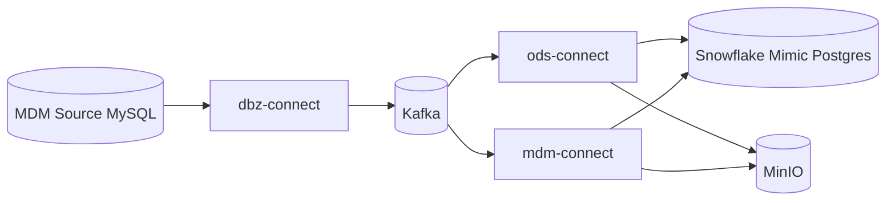
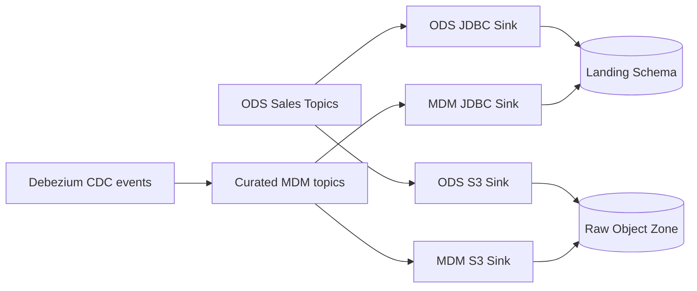

# Kafka Connect Integration

This sub-project provides Kafka Connect runtimes and connector configurations for the local data platform.

## Overview

The `kafka-connect` folder contains three logical connector runtimes used in Routine A (Docker Compose):

- `dbz-connect`: Captures CDC changes from MySQL MDM source tables.
- `ods-connect`: Sinks realtime sales topics to Postgres landing tables and MinIO raw objects.
- `mdm-connect`: Sinks curated MDM topics to Postgres landing tables and MinIO raw objects.

Connector registration is automated through init scripts that wait for each Connect REST API to become ready and then register connector configs via idempotent `PUT` calls.

## Project Structure

- `dbz-connect/`
  - `Dockerfile`
  - `connector-configs/dbz-mysql-mdm.json`
- `ods-connect/`
  - `Dockerfile`
  - `connector-configs/jdbc-sales-order-warehouse.json`
  - `connector-configs/jdbc-sales-order-line-item-warehouse.json`
  - `connector-configs/jdbc-customer-sales-warehouse.json`
  - `connector-configs/s3-sales-order.json`
  - `connector-configs/s3-sales-order-line-item.json`
  - `connector-configs/s3-customer-sales.json`
- `mdm-connect/`
  - `Dockerfile`
  - `connector-configs/jdbc-mdm-warehouse.json`
  - `connector-configs/s3-mdm-customer.json`
  - `connector-configs/s3-mdm-product.json`
  - `connector-configs/s3-mdm-date.json`
- `scripts/`
  - `register-dbz-connectors.sh`
  - `register-ods-connectors.sh`
  - `register-mdm-connectors.sh`

## Component Diagram



## Data Flow Diagram



## Connector Dataflow Summary

### Debezium CDC

- Source: MySQL `mdm` database tables (`customer360`, `product_master`, `date`)
- Connector class: `io.debezium.connector.mysql.MySqlConnector`
- Output: Kafka CDC topics with `topic.prefix=mysql

### ODS Connect Sinks

- Topics: `sales_order`, `sales_order_line_item`, `customer_sales`
- JDBC sink target format: `landing.${topic}` in Postgres
- S3 sink target path: `raw/...` in MinIO bucket

### MDM Connect Sinks

- Curated topics: `mdm_customer`, `mdm_product`, `mdm_date` to MinIO via S3 sink connectors
- JDBC topics: `mdm_customer_jdbc`, `mdm_product_jdbc`, `mdm_date_jdbc`
- JDBC topic rewrite: strips `_jdbc`, then writes to `landing.${topic}`

## How Connector Registration Works

Each registration script follows the same flow:

1. Resolve `CONNECT_URL` (with a sensible service default).
2. Wait for `GET /connector-plugins` to succeed.
3. Read connector config filenames from `CONNECTOR_FILES`.
4. For each config:
   - Parse connector name and config payload via `jq`.
   - Register/update via `PUT /connectors/{name}/config`.

This makes repeated startup safe and idempotent.

## Usage

### Routine A (recommended)

From repository root:

```bash
make compose-up
```

This brings up services and runs the related connect init containers that call the registration scripts.

### Manual registration inside init-like containers

```bash
CONNECT_URL=http://dbz-connect:8083 sh kafka-connect/scripts/register-dbz-connectors.sh
CONNECT_URL=http://ods-connect:8083 sh kafka-connect/scripts/register-ods-connectors.sh
CONNECT_URL=http://mdm-connect:8083 sh kafka-connect/scripts/register-mdm-connectors.sh
```

Note: these scripts expect `/connectors` to contain the mounted JSON configs, matching the Compose init container setup.

## Quick Validation

After startup, verify connectors are present:

```bash
curl -fsS http://localhost:8083/connectors | jq .
curl -fsS http://localhost:8087/connectors | jq .
curl -fsS http://localhost:8085/connectors | jq .
```

You can also use project operations commands from the root runbook, for example:

- `make mdm-topics-check`
- `make mdm-flow-check`

## References

- `../docker-compose.yml`
- `../docs/architecture.md`
- `../docs/runbook.md`
