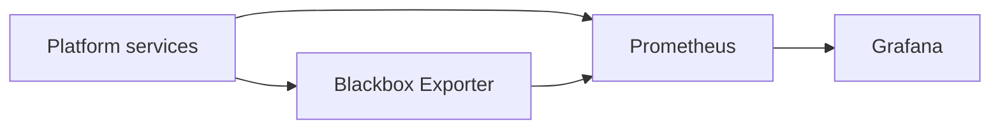
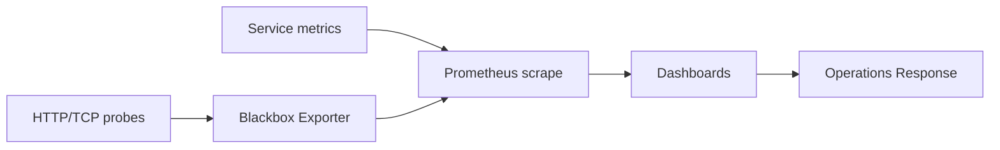

# Observability Stack

This sub-project provides observability and monitoring capabilities for the GenAI-Enabled Data Platform.

## Overview
The Observability Stack integrates monitoring, logging, and alerting tools to ensure the health, performance, and reliability of the platform. It typically includes components such as Prometheus, Grafana, and Blackbox Exporter, and can be extended with additional tools as needed.

## Key Features
- Metrics collection and monitoring (Prometheus)
- Visualization and dashboards (Grafana)
- Endpoint and service health checks (Blackbox Exporter)
- Centralized logging (optional, e.g., Loki, ELK)
- Alerting and notifications

## Project Structure
- `blackbox/`: Blackbox Exporter configuration and deployment
- `grafana/`: Grafana dashboards and configuration
- `prometheus/`: Prometheus configuration and rules

## Component Diagram

## Data Flow Diagram

## Usage
1. Deploy the observability stack using Docker Compose or Kubernetes manifests
2. Access Grafana dashboards for real-time monitoring
3. Configure alerting rules and notifications as needed

## Requirements
- Docker or Kubernetes for deployment
- Platform integration for metrics and logs

## More Information
See the main project documentation for architecture, integration, and operational details.
