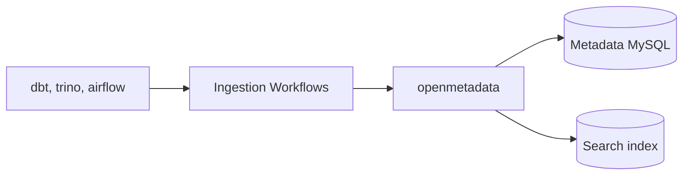
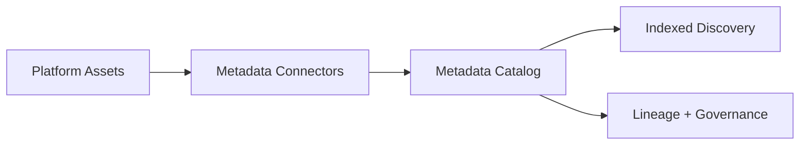

# Metadata Service

This sub-project provides metadata management capabilities for the GenAI-Enabled Data Platform.

## Overview

The Metadata Service is responsible for cataloging, managing, and serving metadata about datasets, pipelines, and platform assets. It enables data discovery, governance, and lineage tracking, and typically integrates with tools like OpenMetadata or similar data catalog solutions.

## Key Features

- Centralized metadata catalog for datasets, tables, and pipelines
- Supports data discovery and governance
- Enables lineage tracking and impact analysis
- Integrates with platform components (e.g., dbt, Trino, Airflow)
- Can be extended for custom metadata needs

## Project Structure

- `platform-services/metadata/openmetadata/`: Contains configuration and deployment files for OpenMetadata or other metadata tools

## Component Diagram

## Data Flow Diagram

## Usage

1. Configure and deploy the metadata service (e.g., OpenMetadata)
2. Integrate with other platform components for metadata ingestion
3. Use the metadata UI or APIs for search, discovery, and governance

## Requirements

- Docker (for containerized deployment)
- Platform integration (dbt, Trino, Airflow, etc.)

## More Information

See the main project documentation for architecture, integration, and operational details.
