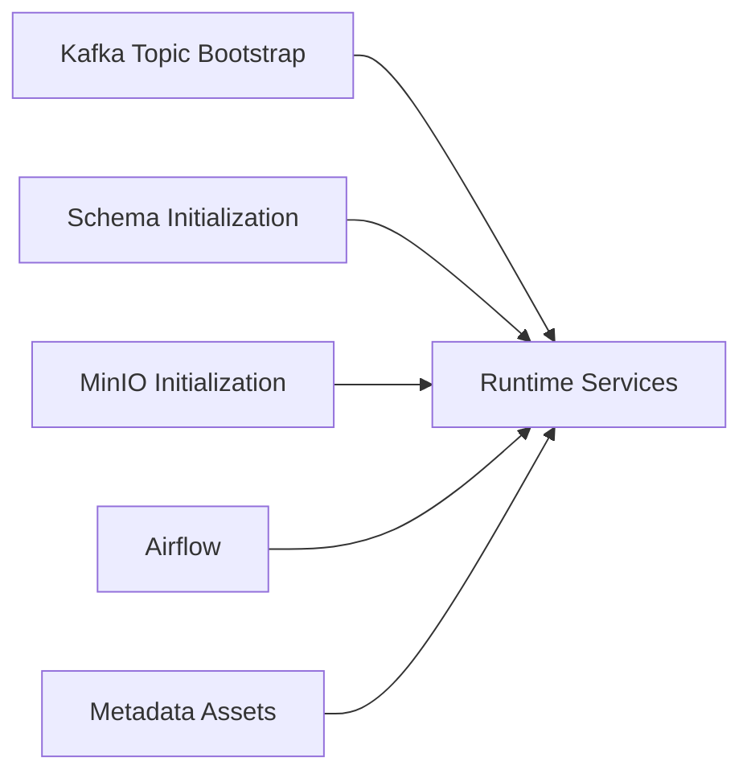
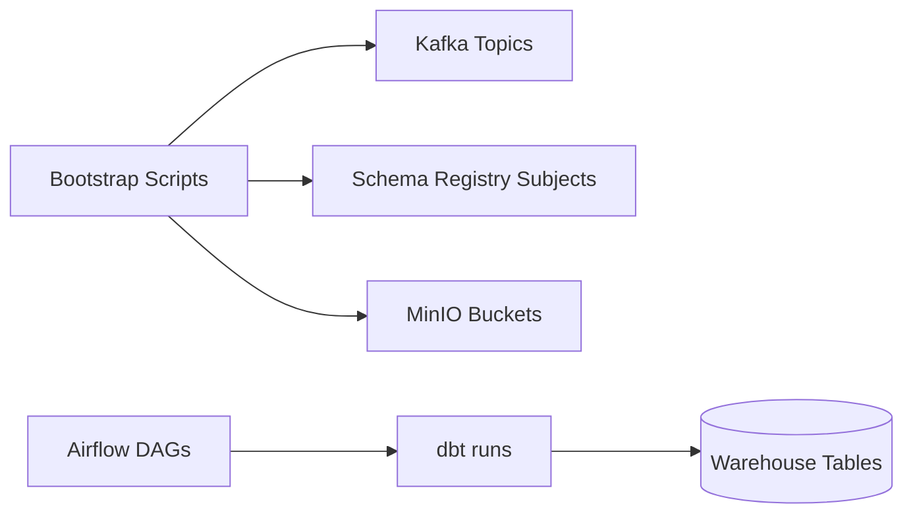

# Platform Services

This sub-project contains shared platform runtime services and bootstrap assets used by the local data platform.

## Overview

The `platform-services` folder provides foundational services that support ingestion, orchestration, schema governance, metadata, and object storage workflows across Routine A (Docker Compose) and Routine B (kind + Helm + Argo CD).

These services are not domain apps themselves. They provide core capabilities consumed by source apps, processing apps, and analytics components.

## Key Components

- Airflow orchestration runtime for scheduled dbt workflows and operational DAGs
- Kafka bootstrap helpers for topic creation and broker-side setup scripts
- Metadata service assets for OpenMetadata ingestion and catalog operations
- MinIO bootstrap script for object storage bucket initialization
- Schema Registry bootstrap image and Avro schema registration assets

## Project Structure

- `airflow/`
  - `Dockerfile`
  - `start-airflow.sh`
  - `dags/`
- `kafka/`
  - `docker-create-topics.sh`
  - `kafka-topics.sh`
- `metadata/`
  - `readme.md`
  - `openmetadata/`
- `minio/`
  - `init-minio.sh`
- `schemas/`
  - `Dockerfile`
  - `avro/`

## Component Diagram



## Data Flow Diagram



## How It Fits The Runtime

In Routine A, these services and scripts are wired through Docker Compose init and long-running containers.

Typical startup responsibilities:

1. Kafka topics are created by the Kafka bootstrap script.
2. Avro schemas are registered to Schema Registry.
3. MinIO buckets are initialized.
4. Airflow starts and exposes DAG-based orchestration.
5. Metadata services (optional profile) can ingest platform metadata.

## Usage

From repository root, use the documented workflow entrypoints:

```bash
make compose-up
make mdm-status
make compose-down
```

Refer to the runbook for full command bundles and validation routines.

## Requirements

- Docker Desktop for local container runtime
- Optional: kind, kubectl, Helm, and Argo CD for Kubernetes/GitOps routine

## References

- `../docker-compose.yml`
- `../docs/architecture.md`
- `../docs/runbook.md`
