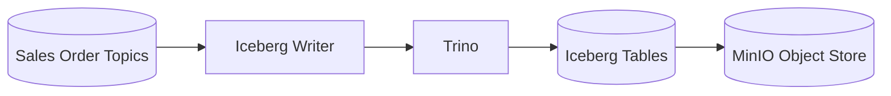

# Iceberg Writer

This sub-project provides a service for writing data to Apache Iceberg tables as part of the GenAI-Enabled Data Platform.

## Overview
The Iceberg Writer is responsible for ingesting, transforming, and persisting data into Iceberg tables, which are used for scalable, high-performance analytics on data lakes. It is designed to work as a microservice within the broader platform architecture.

## Key Features
- Writes data to Apache Iceberg tables
- Supports batch and/or streaming ingestion patterns
- Integrates with other platform components (e.g., Kafka, Trino, MinIO)
- Built for reliability and scalability

## Project Structure
- `app/`: Main application code (entry point: `main.py`)
- `Dockerfile`: Container definition for deployment
- `pyproject.toml`: Python dependencies and project metadata
- `wait-for-it.sh`: Utility script for service startup dependencies

## Component Diagram



## Data Flow Diagram


## Usage
1. Build the Docker image:
   ```sh
   docker build -t iceberg-writer .
   ```
2. Run the service (example):
   ```sh
   docker run --rm iceberg-writer
   ```
3. Configure environment variables and connections as needed for your deployment.

## Requirements
- Python 3.8+
- Apache Iceberg compatible storage (e.g., MinIO, S3, HDFS)
- Platform dependencies (Kafka, Trino, etc.)

## More Information
See the main project documentation for architecture and integration details.
