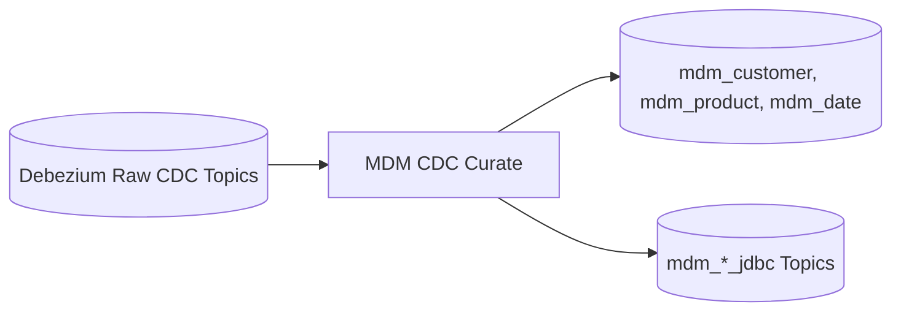
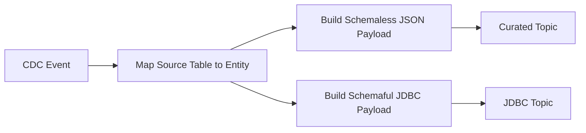

# MDM CDC Curate

This sub-project is responsible for curating Change Data Capture (CDC) events for Master Data Management (MDM) within the GenAI-Enabled Data Platform.

## Overview
The MDM CDC Curate service consumes raw Debezium CDC events from Kafka, curates and enriches them, and republishes clean `mdm_customer` and `mdm_product` events to downstream topics.

## Key Features
- Captures inserts, updates, and deletes from MDM sources
- Publishes CDC events to Kafka topics
- Integrates with the platform's streaming and analytics pipelines
- Designed for reliability and scalability

## Project Structure
- `app/`: Main application code
- `Dockerfile`: Container definition for deployment
- `pyproject.toml`: Python dependencies and project metadata

## Component Diagram



## Data Flow Diagram



## Usage
1. Build the Docker image:
   ```sh
   docker build -t mdm-cdc-curate .
   ```
2. Run the service (example):
   ```sh
   docker run --rm mdm-cdc-curate
   ```
3. Configure environment variables and connections as needed for your deployment.

## Requirements
- Python 3.8+
- Access to MDM data sources (e.g., MySQL, Postgres)
- Kafka cluster for event publishing

## More Information
See the main project documentation for architecture and integration details.
