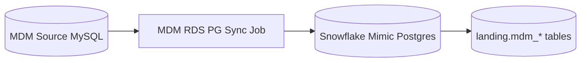
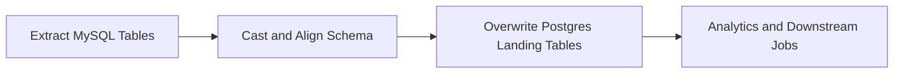

# MDM PySpark Sync

This sub-project provides a PySpark-based synchronization service for Master Data Management (MDM) within the GenAI-Enabled Data Platform.

## Overview
The MDM PySpark Sync service is designed to efficiently synchronize, transform, and propagate master data between source systems and the platform's analytical layers. It leverages Apache Spark for scalable data processing and can be integrated into batch or streaming pipelines.

## Key Features
- Uses Apache Spark (PySpark) for distributed data processing
- Synchronizes master data from operational sources to analytics layers
- Supports data transformation and enrichment
- Integrates with other platform components (e.g., data lake, Kafka, Iceberg)

## Project Structure
- `app/`: Main PySpark application code
- `Dockerfile`: Container definition for deployment

## Component Diagram



## Data Flow Diagram



## Usage
1. Build the Docker image:
   ```sh
   docker build -t mdm-pyspark-sync .
   ```
2. Run the service (example):
   ```sh
   docker run --rm mdm-pyspark-sync
   ```
3. Configure Spark and environment variables as needed for your deployment.

## Requirements
- Python 3.8+
- Apache Spark (PySpark)
- Access to MDM data sources and target storage (e.g., S3, MinIO, HDFS)

## More Information
See the main project documentation for architecture and integration details.
