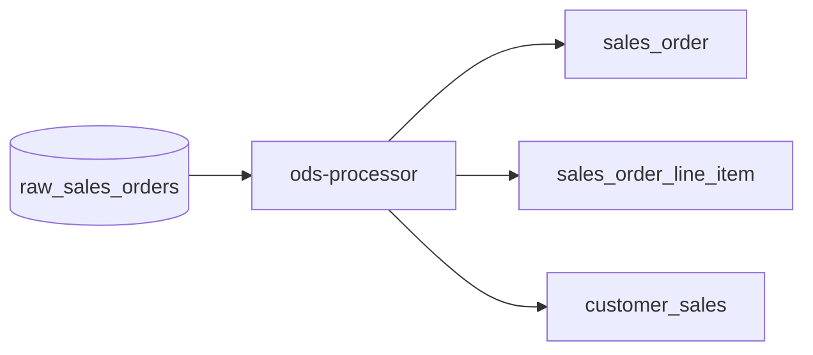
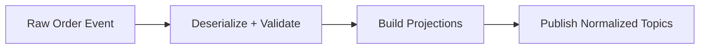

# Processor

This sub-project provides a real-time and batch data processing service for the GenAI-Enabled Data Platform.

## Overview
The Processor service is responsible for transforming, enriching, and routing data between various components of the platform. It can be used for streaming ETL, event-driven processing, and integration with downstream analytics or storage systems.

## Key Features
- Processes data from Kafka topics or other sources
- Supports transformation, enrichment, and filtering logic
- Publishes processed data to target systems (e.g., Kafka, Iceberg, data lake)
- Built for both real-time (streaming) and batch workloads
- Scalable and extensible architecture

## Project Structure
- `src/`: Main application source code
- `Dockerfile`: Container definition for deployment
- `pom.xml`: Maven project configuration (Java/Scala)
- `wait-for-it.sh`: Utility script for service startup dependencies

## Component Diagram



## Data Flow Diagram



## Usage
1. Build the project (example for Maven):
   ```sh
   cd processor
   mvn package -DskipTests
   ```
2. Build the Docker image:
   ```sh
   docker build -t processor .
   ```
3. Run the service (example):
   ```sh
   docker run --rm processor
   ```
4. Configure environment variables and connections as needed for your deployment.

## Requirements
- Java 11+ (or as specified in pom.xml)
- Kafka cluster for event streaming
- Access to target storage (e.g., Iceberg, S3, MinIO)

## More Information
See the main project documentation for architecture and integration details.
