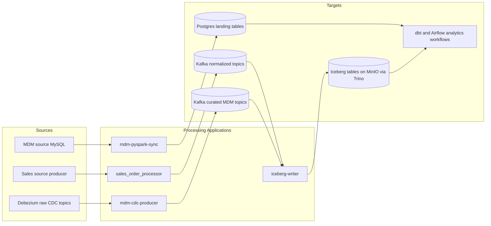

# Processing Applications

This sub-project contains the runtime processing services that transform, route, and synchronize data across the platform.

## Overview

The `processing-apps` folder hosts the core stream and sync workloads used in local Routine A and Kubernetes-based Routine B. These services sit between source systems and analytics targets.

## Applications

- `sales_order_processor`
  - Java Spring Boot application running Apache Flink stream logic
  - Consumes `raw_sales_orders`
  - Produces normalized topics: `sales_order`, `sales_order_line_item`, `customer_sales`

- `mdm-cdc-producer`
  - Python CDC curation service
  - Consumes Debezium raw MDM CDC topics
  - Produces curated topics: `mdm_customer`, `mdm_product` (and date stream where configured)

- `mdm-pyspark-sync`
  - PySpark sync job from MySQL MDM source to Postgres landing
  - Periodically syncs MDM tables into warehouse landing tables used by analytics

- `iceberg-writer`
  - Python streaming writer
  - Consumes Kafka topics and writes to Iceberg tables through Trino
  - Targets MinIO-backed lakehouse tables

## Project Structure

- `sales_order_processor/`
  - `src/`
  - `pom.xml`
  - `Dockerfile`
- `mdm-cdc-producer/`
  - `app/`
  - `pyproject.toml`
  - `Dockerfile`
- `mdm-pyspark-sync/`
  - `app/`
  - `Dockerfile`
- `iceberg-writer/`
  - `app/`
  - `pyproject.toml`
  - `Dockerfile`

## Dataflow Responsibilities

Diagram: processing applications pipeline (left to right).



1. Source producer publishes raw sales events to Kafka.
2. `sales_order_processor` normalizes and fans out transactional topics.
3. Kafka Connect sinks events to Postgres landing and MinIO raw zones.
4. `mdm-cdc-producer` curates MDM CDC streams for downstream consumers.
5. `mdm-pyspark-sync` performs table-level MDM synchronization into Postgres landing.
6. `iceberg-writer` writes streaming Kafka data into Iceberg tables via Trino.
7. dbt and Airflow consume landing/lakehouse assets for medallion analytics workflows.

## Usage

From repository root, use the standard workflow entrypoints:

```bash
make docker-compose-up
make mdm-flow-check
make docker-compose-down
```

For service-specific runtime and troubleshooting steps, refer to each app folder README and the platform runbook.

## References

- `../docs/architecture.md`
- `../docs/runbook.md`
- `../docker-compose.yml`
