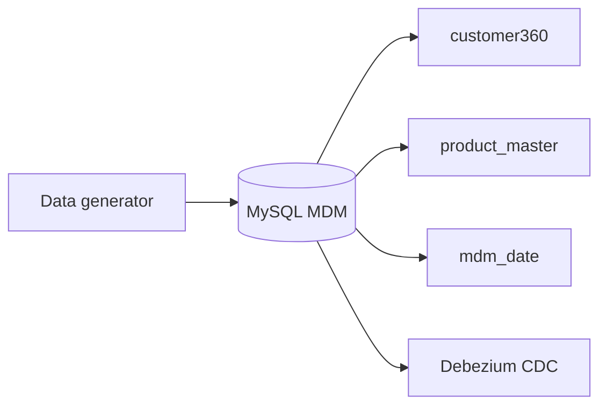
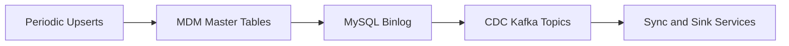

# MDM Source System

This folder simulates a Master Data Management (MDM) source system that continuously generates and manages master data for three core tables in a MySQL database:

- `customer360`: Customer master data
- `product_master`: Product master data
- `mdm_date`: Date dimension data

## Purpose
The MDM source system is designed to:
- Act as the authoritative source for core master data entities
- Continuously generate and update records in the MySQL database
- Serve as the upstream system for CDC (Change Data Capture) pipelines (e.g., Debezium)
- Enable downstream synchronization to data lakes, warehouses, and analytics platforms

## Key Components
- `sql/init.sql`: DDL and initial data for the three master tables
- (You can add) Data generator scripts (Python, SQL, etc.) to simulate ongoing changes
- Integration with CDC tools (e.g., Debezium) for real-time data propagation

## Component Diagram



## Data Flow Diagram



## Example Table Definitions
- `customer360`: Stores customer profile and attributes
- `product_master`: Stores product catalog and attributes
- `mdm_date`: Stores date dimension for analytics

## How to Use
1. Deploy a MySQL instance (e.g., via Docker Compose)
2. Run `init.sql` to create and seed the master tables
3. (Optional) Add or schedule scripts to periodically insert/update/delete records for CDC testing
4. Integrate with Debezium or other CDC tools to capture changes

## Example: Running init.sql
```sh
mysql -u <user> -p<password> -h <host> <database> < sql/init.sql
```

## Extending
- Add Python or SQL scripts to generate random or realistic changes to the master tables
- Schedule these scripts with cron or as a long-running service for continuous data changes
- Integrate with the platform's CDC pipeline for end-to-end testing

## More Information
See the main project documentation for CDC pipeline and integration details.
