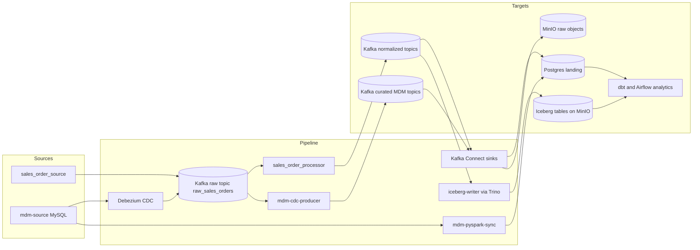

# Source Applications

This sub-project contains the upstream source services that generate and own initial data for the platform.

## Overview

The source applications are the starting point of the data pipeline. They publish transactional events and maintain master data that downstream streaming, CDC, lakehouse, and analytics services consume.

## Applications

- sales_order_source
  - Python producer service for sales events
  - Publishes composite sales messages to the raw_sales_orders Kafka topic
  - Drives the realtime stream-processing pipeline

- mdm-source
  - MySQL-based master data source simulator
  - Owns customer360, product_master, and mdm_date tables
  - Serves as the upstream system for Debezium CDC capture

## Project Structure

- sales_order_source/
  - app/
  - Dockerfile
  - pyproject.toml
- mdm-source/
  - sql/
  - Dockerfile
  - readme.md

## Dataflow Responsibilities

Diagram: source applications pipeline (left to right).



1. sales_order_source produces raw sales events to Kafka.
2. mdm-source stores and updates master data in MySQL.
3. Debezium captures mdm-source table changes and emits CDC topics.
4. Downstream processing applications and connectors transform and land source data into Postgres, MinIO, and Iceberg targets.

## Usage

From repository root, use the standard routine entrypoints:

```bash
make docker-compose-up
make mdm-status
make mdm-topics-check
```

For app-specific behavior and configuration, see each subfolder README.

## Requirements

- Docker Desktop for local runtime
- Kafka and MySQL services available through the platform stack

## References

- ../docker-compose.yml
- ../docs/architecture.md
- ../docs/runbook.md
