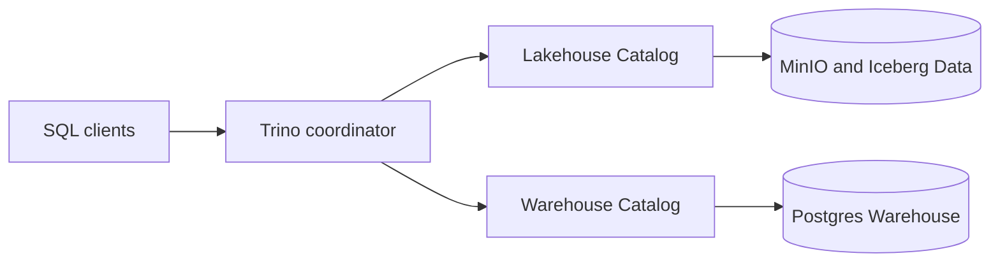
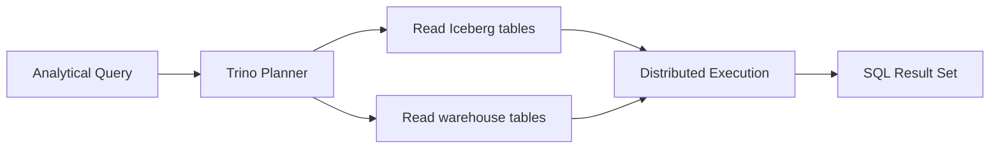

# Trino Integration

This sub-project provides configuration and integration for Trino (formerly PrestoSQL) within the GenAI-Enabled Data Platform.

## Overview
Trino is an open-source distributed SQL query engine designed for running fast analytic queries across various data sources. In this platform, Trino is used to provide unified SQL access to data in the data lake (e.g., Iceberg tables), data warehouse, and other sources.

## Key Features
- Distributed SQL query engine for analytics
- Supports querying data from Iceberg, Hive, Postgres, and more
- Integrates with platform components (MinIO, Kafka, dbt, etc.)
- Configurable catalogs and connectors
- Scalable and high-performance

## Project Structure
- `etc/`: Trino configuration files (e.g., `config.properties`, `catalog/`)
- `sql/`: Example SQL scripts and queries for Trino

## Component Diagram

## Data Flow Diagram

## Usage
1. Configure Trino by editing files in the `etc/` directory
2. Start Trino using Docker Compose or Kubernetes manifests
3. Connect to Trino via the web UI or CLI (default port 8086)
4. Run SQL queries against your data lake and other sources

## Requirements
- Docker or Kubernetes for deployment
- Access to data sources (MinIO, Postgres, etc.)

## More Information
See the main project documentation for architecture, integration, and operational details.
